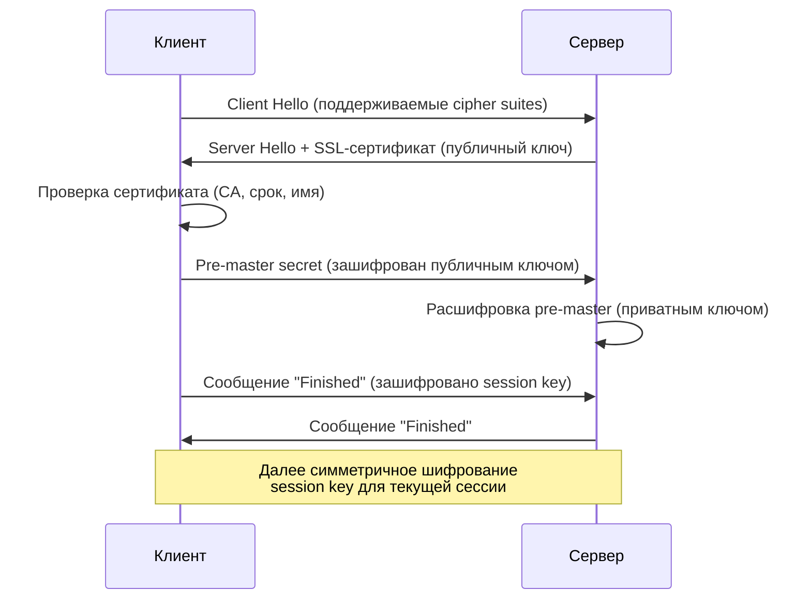

## Структура HTTP-запроса

```text
POST /api/users HTTP/1.1
Host: example.com
User-Agent: Mozilla/5.0
Accept: application/json
Accept-Language: ru-RU
Accept-Encoding: gzip, deflate
Connection: keep-alive
Content-Type: application/json
Content-Length: 45

{"name":"John","email":"john@example.com"}
```

| Часть                | Описание                                                   |
| -------------------- | ---------------------------------------------------------- |
| **Стартовая строка** | Метод, путь, версия протокола (`POST /api/users HTTP/1.1`) |
| **Заголовки**        | Метаданные запроса (Host, Content-Type, Authorization)     |
| **Пустая строка**    | Разделитель между заголовками и телом                      |
| **Тело**             | Данные (для POST, PUT, PATCH)                              |

### Категории заголовков

- **Общего назначения** — `Connection`, `Date`, `Cache-Control`;
- **Запроса** — `Host`, `User-Agent`, `Accept`, `Authorization`;
- **Представления** — `Content-Type`, `Content-Length`, `Content-Encoding`.

## Структура HTTP-ответа

```text
HTTP/1.1 200 OK
Content-Type: application/json
Content-Length: 27

{"id":1,"name":"John"}
```

| Часть | Описание |
|-------|----------|
| **Стартовая строка** | Версия, код статуса, текстовое описание (`HTTP/1.1 200 OK`) |
| **Заголовки** | Метаданные ответа |
| **Пустая строка** | Разделитель |
| **Тело** | Данные ответа |

## HTTP-методы

| Метод | Описание | Идемпотентность | Безопасность |
|-------|----------|----------------|--------------|
| **GET** | Получение ресурса | Да | Да |
| **POST** | Создание ресурса | Нет | Нет |
| **PUT** | Полная замена ресурса | Да | Нет |
| **PATCH** | Частичное обновление | Нет | Нет |
| **DELETE** | Удаление ресурса | Да | Нет |
| **HEAD** | Получение метаданных (без тела) | Да | Да |
| **OPTIONS** | Получение доступных методов | Да | Да |

**Идемпотентность** — повторный вызов с теми же параметрами даёт тот же результат (без побочных эффектов).

## Коды статуса HTTP

| Код | Значение | Когда используется |
|-----|----------|------------------|
| **2xx** | **Успех** | |
| 200 | OK | Успешный GET, PUT, DELETE |
| 201 | Created | Успешный POST (ресурс создан) |
| 204 | No Content | Успешный DELETE без тела ответа |
| **3xx** | **Перенаправление** | |
| 301 | Moved Permanently | Ресурс перемещён навсегда |
| 302 | Found | Временное перенаправление |
| 304 | Not Modified | Кэш валиден (условный GET) |
| **4xx** | **Ошибка клиента** | |
| 400 | Bad Request | Невалидный запрос |
| 401 | Unauthorized | Требуется аутентификация |
| 403 | Forbidden | Доступ запрещён |
| 404 | Not Found | Ресурс не найден |
| 409 | Conflict | Конфликт состояния ресурса |
| 422 | Unprocessable Entity | Валидация не пройдена |
| **5xx** | **Ошибка сервера** | |
| 500 | Internal Server Error | Внутренняя ошибка |
| 502 | Bad Gateway | Прокси получил невалидный ответ |
| 503 | Service Unavailable | Сервис временно недоступен |
| 504 | Gateway Timeout | Прокси не дождался ответа |

## REST (Representational State Transfer)

Архитектурный стиль проектирования API:

1. **Клиент-сервер** — разделение ответственности;
2. **Без состояния (Stateless)** — каждый запрос содержит всю необходимую информацию;
3. **Кэшируемость** — ответы должны явно указывать возможность кэширования;
4. **Единообразие интерфейса** — ресурсы идентифицируются URI, манипулируются через представления;
5. **Слоистая система** — клиент не знает о промежуточных серверах.

**REST API Contract** — описание endpoints, методов, параметров, форматов запросов/ответов. Часто оформляется через:
- **OpenAPI (Swagger)** — спецификация и интерактивная документация;
- **Postman Collections** — коллекции запросов для тестирования.

## REST vs SOAP

| Критерий | REST | SOAP |
|---|------|------|
| Протокол | HTTP | Любой транспорт (HTTP, SMTP, TCP) |
| Формат | JSON, XML, и др. | Только XML |
| Спецификация | Архитектурный стиль | Протокол (WSDL + SOAP envelope) |
| Безопасность | HTTPS + OAuth/JWT | WS-Security |
| Транзакции | Нет встроенной поддержки | ACID через WS-AtomicTransaction |
| Кэширование | Простое (HTTP cache) | Сложное |

## SSL/TLS

SSL (Secure Sockets Layer) / TLS (Transport Layer Security) — криптографический протокол для защищённого соединения.

### Принцип работы (Handshake)



1. Клиент запрашивает SSL-сертификат;
2. Браузер проверяет: имя сайта, срок действия, подпись доверенного CA;
3. Клиент генерирует **pre-master secret**, шифрует публичным ключом сервера;
4. Сервер расшифровывает приватным ключом, создаёт **master secret**;
5. Оба участника используют **симметричный session key** для шифрования данных;
6. Session key уничтожается после завершения сессии.

## Cookies

Cookies — небольшие фрагменты данных, которые сервер отправляет браузеру, а браузер возвращает с каждым запросом к этому домену.

**Атрибуты:**
- `HttpOnly` — недоступны из JavaScript (защита от XSS);
- `Secure` — передаются только по HTTPS;
- `SameSite` — контроль отправки при cross-origin запросах (`Strict`, `Lax`, `None`);
- `Max-Age` / `Expires` — время жизни;
- `Domain` / `Path` — область видимости.

## URL / URI best practices

- Использовать lowercase;
- Разделять слова дефисом (`/user-orders`);
- Избегать подчёркиваний и camelCase в пути;
- Версионировать API (`/v1/users`);
- Использовать существительные во множественном числе (`/orders` вместо `/getOrders`);
- Не использовать глаголы в URI (это задача HTTP-метода).
