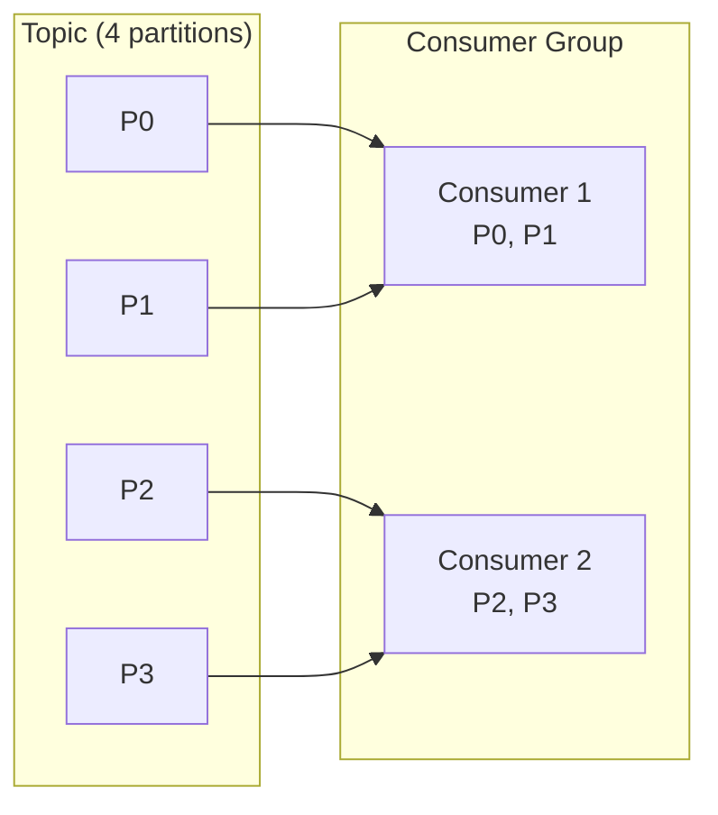
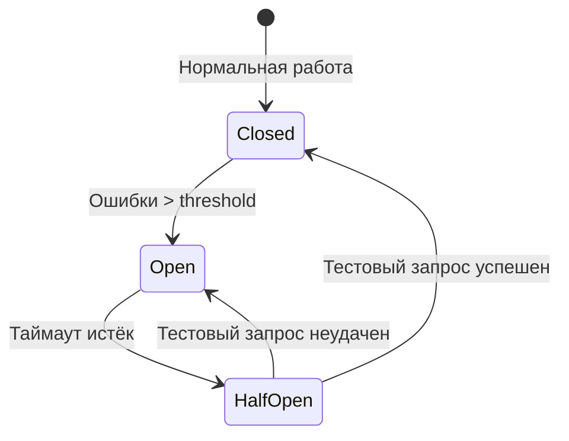

# Архитектура, DevOps и методологии

## Микросервисы vs Монолит

| | Монолит | Микросервисы |
|---|---------|--------------|
| **Архитектура** | Единое приложение | Разделение на независимые сервисы |
| **Развёртывание** | Единый артефакт | Независимое развёртывание каждого сервиса |
| **Масштабирование** | Масштабирование всего приложения | Масштабирование отдельных сервисов |
| **Технологии** | Единый стек | Разные стеки для разных сервисов |
| **Сложность** | Ниже в начале | Выше инфраструктурная сложность |
| **Отказоустойчивость** | Всё или ничего | Частичная деградация |

### Паттерн Saga

Saga управляет распределённой транзакцией как последовательностью локальных транзакций. Если одна транзакция не удалась, выполняются компенсирующие транзакции.

**Типы Saga:**
1. **Choreography** — сервисы публикуют события, другие реагируют. Нет центрального координатора;
2. **Orchestration** — центральный координатор управляет последовательностью шагов.

### Transactional Outbox

Решение проблемы согласованности БД и брокера сообщений:
1. Событие записывается в таблицу `outbox` внутри основной транзакции;
2. Отдельный процесс (relay) читает из `outbox` и публикует в Kafka/RabbitMQ;
3. После подтверждения публикации запись удаляется.

---

## CI/CD

| | CI (Continuous Integration) | CD (Continuous Delivery/Deployment) |
|---|---------------------------|-----------------------------------|
| **Цель** | Автоматическая сборка и тестирование | Автоматическое развёртывание |
| **Триггер** | Push / Merge Request | Успешный CI pipeline |
| **Результат** | Проверенный артефакт | Артефакт в нужном окружении |

**Pipeline этапы:**
1. Build — компиляция, сборка артефакта;
2. Test — unit, integration, contract tests;
3. Security scan — SAST/DAST, dependency check;
4. Deploy to staging — развёртывание в тестовое окружение;
5. Integration/E2E tests — приёмочное тестирование;
6. Deploy to production — развёртывание в прод (может быть с approval).

---

## Docker

**Контейнер** — изолированный процесс с собственной файловой системой, сетью и ресурсами.

**Основные команды:**

```bash
docker build -t myapp:1.0 .          # Сборка образа
docker run -p 8080:8080 myapp:1.0    # Запуск контейнера
docker ps                            # Список запущенных
docker stop <id>                     # Остановка
docker logs <id>                     # Логи
docker exec -it <id> /bin/sh         # Вход в контейнер
```

### Docker Compose

Определяет и запускает мультиконтейнерные приложения:

```yaml
version: '3.8'
services:
  app:
    build: .
    ports:
      - "8080:8080"
    environment:
      - SPRING_PROFILES_ACTIVE=prod
    depends_on:
      - db
  db:
    image: postgres:15
    environment:
      POSTGRES_DB: mydb
      POSTGRES_PASSWORD: secret
    volumes:
      - pgdata:/var/lib/postgresql/data
volumes:
  pgdata:
```

### Dockerfile best practices

- Использовать минимальный базовый образ (`eclipse-temurin:17-jre-alpine`);
- Многоэтапная сборка (multi-stage) — отдельный этап для компиляции;
- Запускать не от root (`USER 1000:1000`);
- Минимизировать слои (объединять RUN-команды);
- Использовать `.dockerignore`.

---

## Kubernetes

Платформа оркестрации контейнеров.

### Основные объекты

| Объект | Назначение |
|--------|-----------|
| **Pod** | Минимальная deployable единица (1+ контейнеров) |
| **Deployment** | Управление репликами Pod, rolling updates |
| **Service** | Стабильный сетевой доступ к Pod (ClusterIP, NodePort, LoadBalancer) |
| **Ingress** | HTTP/HTTPS маршрутизация внешнего трафика |
| **ConfigMap** | Конфигурационные данные |
| **Secret** | Чувствительные данные (пароли, токены) |
| **PersistentVolume** | Хранилище данных вне Pod |
| **Namespace** | Логическое разделение кластера |

### Масштабирование в Kubernetes

**Horizontal Pod Autoscaler (HPA):**
```yaml
apiVersion: autoscaling/v2
kind: HorizontalPodAutoscaler
metadata:
  name: myapp-hpa
spec:
  scaleTargetRef:
    apiVersion: apps/v1
    kind: Deployment
    name: myapp
  minReplicas: 2
  maxReplicas: 10
  metrics:
    - type: Resource
      resource:
        name: cpu
        target:
          type: Utilization
          averageUtilization: 70
```

---

## Системы сообщений

### Kafka

Распределённая потоковая платформа (event streaming).

**Концепции:**
- **Topic** — категория сообщений;
- **Partition** — сегмент topic, обеспечивает параллелизм;
- **Producer** — публикует сообщения;
- **Consumer** — читает сообщения;
- **Consumer Group** — группа потребителей, каждая партиция читается только одним членом группы;

### Consumer Group

Consumer Group — логическая группа потребителей, которая совместно читает сообщения из topic.

**Принципы работы:**
- Каждая партиция topic назначается **только одному** consumer внутри группы;
- Если consumer больше партиций — лишние consumer простаивают;
- Если consumer меньше партиций — один consumer читает несколько партиций;
- При добавлении/удалении consumer происходит **rebalancing** — перераспределение партиций.



**Гарантии доставки:**
- **At most once** — сообщение может быть потеряно (commit до обработки);
- **At least once** — сообщение гарантированно доставлено, возможны дубликаты (commit после обработки);
- **Exactly once** — строго один раз (idempotent producer + transactional consumer, сложно в распределённых системах).
- **Offset** — позиция чтения в партиции;
- **Replication Factor** — количество копий партиции.

**Чего нет в Kafka из коробки:**
- Отложенные сообщения (delayed messages);
- DLQ (Dead Letter Queue);
- AMQP / MQTT протоколы;
- TTL на уровне сообщения;
- Очереди с приоритетами.

### JMS (Java Message Service)

Стандарт Java EE для работы с сообщениями.

| | Point-to-Point | Publish-Subscribe |
|---|----------------|-------------------|
| **Модель** | Queue | Topic |
| **Потребители** | Один получатель | Множество подписчиков |
| **Сообщение** | Доставляется один раз | Доставляется всем подписчикам |

### AMQP / RabbitMQ

AMQP — открытый протокол для обмена сообщениями.

**RabbitMQ:**
- **Exchange** — маршрутизатор сообщений (direct, topic, fanout, headers);
- **Queue** — хранилище сообщений;
- **Binding** — связь exchange и queue с правилом маршрутизации.

---

### Quartz

Quartz — библиотека планирования задач (job scheduling) для Java.

**Основные компоненты:**
- **Job** — интерфейс, реализующий бизнес-логику;
- **Trigger** — определяет расписание (Cron, Simple);
- **Scheduler** — управляет выполнением задач;
- **JobStore** — хранение задач (RAM или JDBC).

```java
@Component
public class ReportJob implements Job {
    @Override
    public void execute(JobExecutionContext context) {
        // выполнение задачи
    }
}

// Spring Boot интеграция
@Configuration
public class QuartzConfig {
    @Bean
    public JobDetail reportJobDetail() {
        return JobBuilder.newJob(ReportJob.class)
            .withIdentity("reportJob")
            .storeDurably()
            .build();
    }

    @Bean
    public Trigger reportJobTrigger() {
        return TriggerBuilder.newTrigger()
            .forJob(reportJobDetail())
            .withIdentity("reportTrigger")
            .withSchedule(CronScheduleBuilder.cronSchedule("0 0 6 * * ?")) // 6:00 daily
            .build();
    }
}
```

### ShedLock

ShedLock гарантирует, что запланированная задача выполняется **максимум в одном экземпляре** в распределённой системе (кластере).

**Принцип:**
- Задача захватывает lock в БД/Redis/Mongo перед выполнением;
- Если lock уже занят другим инстансом — задача пропускается;
- Lock автоматически освобождается по истечении `lockAtMostFor`.

```java
@Scheduled(cron = "0 0 6 * * MON")
@SchedulerLock(name = "weeklyReport", lockAtMostFor = "PT2H", lockAtLeastFor = "PT5M")
public void weeklyReport() {
    // выполняется только на одном инстансе
}
```

| Аннотация | Назначение |
|-----------|-----------|
| `name` | Уникальный идентификатор lock |
| `lockAtMostFor` | Максимальное время удержания lock (если задача упала) |
| `lockAtLeastFor` | Минимальное время удержания lock (защита от double-execution при clock skew) |

---

## Spring Cloud

Набор инструментов для построения распределённых систем на Spring Boot.

### Основные компоненты

| Компонент | Назначение |
|-----------|-----------|
| **Eureka** | Service Discovery — регистрация и обнаружение сервисов |
| **Config Server** | Централизованная конфигурация |
| **Gateway** | API Gateway (маршрутизация, фильтры) |
| **Circuit Breaker** (Resilience4j) | Отказоустойчивость (Circuit Breaker, Retry, RateLimiter) |
| **LoadBalancer** (Ribbon successor) | Клиентская балансировка нагрузки |
| **Sleuth + Zipkin** | Распределённое трассирование |

### Circuit Breaker (Resilience4j)



- **CLOSED** — запросы проходят нормально;
- **OPEN** — запросы немедленно отклоняются (fail fast);
- **HALF-OPEN** — ограниченное число тестовых запросов для проверки восстановления.

---

## Реактивное программирование

### Spring MVC vs Spring WebFlux

| | Spring MVC | Spring WebFlux |
|---|-----------|----------------|
| **Модель** | Thread-per-request | Event loop (Netty) |
| **Потоки** | Блокирующие | Неблокирующие |
| **Пропускная способность** | Хорошая | Высокая при большом числе соединений |
| **Задержка** | Предсказуемая | Может быть выше при малой нагрузке |
| **Базы данных** | Любые | Требуются Reactive Drivers (R2DBC) |
| **API** | `Servlet` | `Reactive Streams` (Mono, Flux) |

**Mono&lt;T&gt;** — 0 или 1 элемент.
**Flux&lt;T&gt;** — 0..N элементов.

---

## Принципы проектирования

### SOLID

| Принцип | Описание |
|---------|----------|
| **S**ingle Responsibility | Класс должен иметь только одну причину для изменения |
| **O**pen/Closed | Открыт для расширения, закрыт для модификации |
| **L**iskov Substitution | Подкласс должен заменять базовый без нарушения корректности |
| **I**nterface Segregation | Много специализированных интерфейсов лучше одного универсального |
| **D**ependency Inversion | Зависимость от абстракций, а не конкретных реализаций |

### DRY, KISS, YAGNI

- **DRY** (Don't Repeat Yourself) — избегай дублирования кода;
- **KISS** (Keep It Simple, Stupid) — простота важнее всего;
- **YAGNI** (You Ain't Gonna Need It) — не добавляй функциональность "на будущее".

---

## Методологии разработки

### Agile vs Waterfall

| | Waterfall | Agile |
|---|-----------|-------|
| **Планирование** | Полное в начале | Итеративное |
| **Изменения** | Сложно внести | Приветствуются |
| **Доставка** | В конце проекта | Частые релизы |
| **Документация** | Подробная | Работающий продукт важнее |

### Scrum

- **Sprint** — фиксированный период (обычно 2 недели);
- **Product Owner** — владелец продукта, приоритезирует бэклог;
- **Scrum Master** — устраняет препятствия;
- **Daily Standup** — ежедневное 15-минутное совещание;
- **Sprint Review** — демонстрация результата;
- **Retrospective** — анализ процесса.

### Kanban

- Визуализация workflow (доска со столбцами);
- Ограничение Work In Progress (WIP);
- Непрерывный поток задач без фиксированных итераций;
- Фокус на оптимизации времени прохождения задачи.

---

## Масштабирование приложений

### Виды масштабирования

| | Вертикальное (Scale Up) | Горизонтальное (Scale Out) |
|---|--------------------------|----------------------------|
| **Способ** | Увеличение ресурсов сервера | Добавление серверов |
| **Предел** | Ограничен железом | Теоретически не ограничен |
| **Сложность** | Ниже | Требует распределённой архитектуры |

### ELK Stack

- **Elasticsearch** — поиск и аналитика;
- **Logstash** — сбор и обработка логов;
- **Kibana** — визуализация данных.

**Альтернативы:** Grafana + Loki + Prometheus (для метрик).

---

## Maven

### Жизненный цикл Maven

| Фаза | Описание |
|------|----------|
| **validate** | Проверка корректности проекта |
| **compile** | Компиляция исходников |
| **test** | Запуск unit-тестов |
| **package** | Упаковка в JAR/WAR |
| **verify** | Проверка готовности (интеграционные тесты) |
| **install** | Установка в локальный репозиторий |
| **deploy** | Развёртывание в удалённый репозиторий |

### Git

| Команда | Назначение |
|---------|-----------|
| `fetch` | Загрузка изменений с удалённого репозитория (без слияния) |
| `pull` | `fetch` + `merge` |
| `push` | Отправка изменений на удалённый репозиторий |
| `merge` | Слияние веток с сохранением истории |
| `rebase` | Перемещение коммитов на новое основание (линейная история) |
| `cherry-pick` | Применение отдельного коммита из другой ветки |
| `squash` | Объединение нескольких коммитов в один |

**Merge vs Rebase:**
- **Merge** — сохраняет полную историю, создаёт merge-коммит;
- **Rebase** — переписывает историю в линейную, не создаёт merge-коммитов. Не использовать для публичных веток.

---

## Linux: основные команды

```bash
# Навигация
ls, cd, pwd, find, locate

# Файлы
cat, less, head, tail, grep, awk, sed

# Процессы
ps, top, htop, kill, systemctl

# Диск
 df, du, mount

# Сеть
netstat, ss, curl, wget, telnet, nc

# Права
chmod, chown, sudo

# Архивы
tar, gzip, unzip
```

---

## XML и схемы (XSD)

### Способы парсинга XML в Java

| Способ | Описание | Когда использовать |
|--------|----------|-----------------|
| **DOM** | Загружает всё дерево XML в память | Небольшие файлы, нужен произвольный доступ |
| **SAX** | Последовательный, event-driven (push) | Большие файлы, только чтение, экономия памяти |
| **StAX** | Pull-parsing, клиент контролирует процесс | Большие файлы, нужен контроль над чтением |
| **JAXB** | XML ↔ Java объекты (marshalling/unmarshalling) | Работа с типизированными данными |

**Пример StAX:**

```java
XMLInputFactory factory = XMLInputFactory.newInstance();
XMLEventReader reader = factory.createXMLEventReader(new FileReader("data.xml"));

while (reader.hasNext()) {
    XMLEvent event = reader.nextEvent();
    if (event.isStartElement() && ((StartElement) event).getName().getLocalPart().equals("user")) {
        // обработка элемента user
    }
}
```

### XSD (XML Schema Definition)

XSD определяет структуру и типы данных XML-документа:
- Элементы, атрибуты, типы (`xs:string`, `xs:date`, `xs:decimal`);
- Ограничения (`minOccurs`, `maxOccurs`, `pattern`, `enumeration`);
- Валидация через `javax.xml.validation.Validator` или `SchemaFactory`.

```java
SchemaFactory factory = SchemaFactory.newInstance(XMLConstants.W3C_XML_SCHEMA_NS_URI);
Schema schema = factory.newSchema(new File("schema.xsd"));
Validator validator = schema.newValidator();
validator.validate(new StreamSource(new File("data.xml")));
```

---

## JEE / Jakarta EE: ключевые спецификации

**Jakarta EE** (ранее Java EE / J2EE) — набор спецификаций для корпоративных Java-приложений.

### Основные спецификации

| Спецификация | Назначение |
|-------------|-----------|
| **Servlet** | Обработка HTTP-запросов (основа Spring MVC) |
| **JSP** | Генерация динамического HTML |
| **JSF** | Компонентный фреймворк для UI |
| **EJB** | Enterprise JavaBeans (Session, Message-Driven, Entity Beans) |
| **JPA** | ORM для работы с БД (также используется в Spring) |
| **JMS** | Работа с очередями сообщений |
| **JTA / JTS** | Управление распределёнными транзакциями |
| **CDI** | Contexts and Dependency Injection (стандарт для DI) |
| **JAX-RS** | REST API (аналог Spring `@RestController`) |
| **JAX-WS** | SOAP веб-сервисы |
| **JAXB** | XML binding (см. выше) |
| **JavaMail** | Отправка email |
| **JNDI** | Доступ к именованным ресурсам (DataSource, EJB) |

**Важно для собеседования:**
- Spring использует и адаптирует многие JEE-спецификации (JPA, JMS, Servlet), но предоставляет более простую модель конфигурации (IoC-контейнер вместо EJB-контейнера);
- EJB уступили место Spring из-за сложности конфигурации и тяжеловесности;
- Jakarta EE 9+ переименовала пакеты с `javax.*` на `jakarta.*`.
