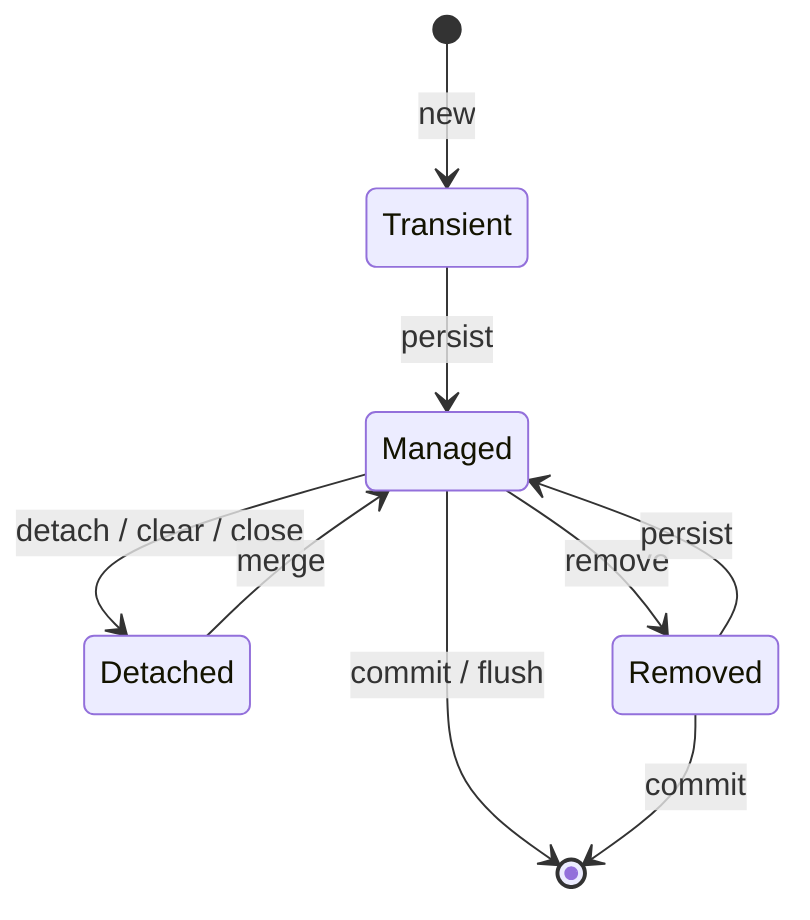

## ORM (Object-Relational Mapping)

ORM — технология, которая позволяет преобразовывать данные между реляционными БД и объектно-ориентированным кодом. В Java ORM используется для упрощения работы с базами данных, избегая прямого написания SQL и сокращая шаблонный код.

**Принцип:** класс Java ↔ таблица БД, поля класса ↔ столбцы таблицы, объект ↔ строка.

**Популярные реализации:** JPA / Hibernate, MyBatis.

---

## JPA (Java Persistence API)

JPA — это **спецификация** Java EE/Java SE, описывающая систему управления сохранением Java-объектов в таблицы реляционных БД. Сама Java не содержит реализации JPA — это лишь набор интерфейсов и аннотаций.

**Реализации JPA:**
- **Hibernate** — самая популярная реализация, де-факто стандарт в Spring;
- **EclipseLink** — референсная реализация от Oracle;
- **OpenJPA** — Apache.

**Основные составляющие JPA:**
- **Entity** — класс, отображаемый на таблицу БД;
- **EntityManager** — главный API для CRUD-операций;
- **JPQL** — объектно-ориентированный язык запросов;
- **Persistence Unit** — конфигурация подключения к БД (DataSource, диалект, настройки).

---

## Hibernate

### Преимущества Hibernate перед JDBC

| Критерий | Hibernate (JPA) | JDBC |
|----------|----------------|------|
| **Зависимость от БД** | Независим (диалекты) | Запросы специфичны для конкретной БД |
| **SQL** | Генерируется автоматически (HQL/JPQL) | Пишется вручную |
| **Пул соединений** | Интегрируется автоматически (HikariCP) | Создаётся вручную |
| **Кэширование** | First/Second level cache | Отсутствует |
| **Ленивая загрузка** | Поддерживается (Lazy Loading) | Реализуется вручную |
| **Транзакции** | Управляются через `@Transactional` | Управляются вручную (`commit/rollback`) |
| **Код** | Меньше шаблонного кода | Много бойлерплейта |

### Требования к Entity (JPA-сущности)

Класс может быть отображён на таблицу БД, если соблюдены следующие требования:

1. **Аннотация `@Entity`** — помечает класс как JPA-сущность;
2. **Публичный конструктор без параметров** — обязателен (default constructor);
3. **Не должен быть `final`** — Hibernate использует прокси для ленивой загрузки;
4. **Поля должны быть `private`/`protected`** с getter/setter (или использование `public` полей — не рекомендуется);
5. **Поле с `@Id`** — первичный ключ обязателен;
6. **Не должен быть enum или interface**.

```java
@Entity
@Table(name = "users")
public class User {
    @Id
    @GeneratedValue(strategy = GenerationType.IDENTITY)
    private Long id;

    @Column(nullable = false, length = 100)
    private String name;

    public User() {} // обязателен

    // getters / setters
}
```

### EntityManager

`EntityManager` — главный API JPA для работы с сущностями. Основные операции:

**Операции над Entity:**
- `persist(entity)` — добавление Entity под управление JPA (вставка);
- `merge(entity)` — обновление отсоединённой сущности;
- `remove(entity)` — удаление;
- `refresh(entity)` — обновление данных из БД;
- `detach(entity)` — удаление из управления JPA;
- `lock(entity, lockMode)` — блокирование от изменений в других потоках.

**Получение данных:**
- `find(Class, id)` — поиск по ID (немедленный запрос);
- `getReference(Class, id)` — ленивый прокси-сущности;
- `createQuery(String)` — создание JPQL-запроса;
- `createNamedQuery(String)` — именованный запрос;
- `createNativeQuery(String)` — нативный SQL-запрос.

### Жизненный цикл Entity



| Состояние | Описание |
|-----------|----------|
| **Transient (New)** | Объект создан, но не связан с сессией. Нет сгенерированного PK. |
| **Managed (Persistent)** | Объект управляется JPA, имеет PK. Изменения синхронизируются с БД. |
| **Detached** | Объект был персистентным, но сейчас не связан с сессией. Может стать персистентным через `merge()`. |
| **Removed** | Объект помечен на удаление, будет удалён после `commit()`. |

### Логирование SQL: spring.jpa.show-sql

```yaml
spring:
  jpa:
    show-sql: true           # выводит SQL в консоль (stderr/stdout)
    properties:
      hibernate:
        format_sql: true     # красивое форматирование
        use_sql_comments: true # добавляет комментарии с именем запроса
```

- `show-sql` — простой способ увидеть генерируемый Hibernate SQL;
- Для production лучше использовать логгер (`logging.level.org.hibernate.SQL=DEBUG`) вместо `show-sql`.

### Batch вставка (Bulk Insert)

При массовой вставке десятков тысяч записей важно периодически сбрасывать буфер сессии, чтобы избежать переполнения памяти:

```java
Session session = sessionFactory.openSession();
Transaction tx = session.beginTransaction();

for (int i = 0; i < 100_000; i++) {
    Customer customer = new Customer("Name" + i, "email" + i + "@example.com");
    session.save(customer); // накапливается в first-level cache

    if (i % 20 == 0) {
        // Периодически вызываем flush() и clear() для оптимизации памяти
        session.flush();  // синхронизирует накопленные изменения с БД
        session.clear();    // очищает first-level cache
    }
}

tx.commit(); // фиксирует оставшиеся изменения
session.close();
```

**Настройки для batch-вставки в Spring Boot:**

```yaml
spring:
  jpa:
    properties:
      hibernate:
        jdbc:
          batch_size: 20          # размер batch
        order_inserts: true     # группировать INSERT по таблицам
        order_updates: true     # группировать UPDATE по таблицам
        generate_statistics: true # статистика для отладки
```

### `load()` vs `get()`

| Критерий | `get()` | `load()` |
|----------|---------|----------|
| Если объект не найден | Возвращает `null` | Выбрасывает `ObjectNotFoundException` |
| Запрос в БД | Немедленный | Отложенный (прокси) |
| Использование | Когда не уверены в существовании объекта | Когда объект точно существует |

### Кэширование

**Уровни кэша:**

1. **First-level cache** (кэш сессии) — включён по умолчанию, нельзя отключить. Кэширует сущности в рамках одной сессии (`EntityManager` / `Session`).
2. **Second-level cache** — отключён по умолчанию. Кэширует сущности между сессиями (на уровне `SessionFactory` / `EntityManagerFactory`).
3. **Query cache** — отключён по умолчанию. Кэширует результаты запросов по ключу (SQL + параметры).

**Включение Second-level cache:**

```yaml
spring:
  jpa:
    properties:
      hibernate:
        cache:
          use_second_level_cache: true
          region:
            factory_class: org.hibernate.cache.jcache.JCacheRegionFactory
```

И на entity:

```java
@Entity
@Cacheable
@Cache(usage = CacheConcurrencyStrategy.READ_WRITE)
public class Product { ... }
```

**Включение Query cache:**

```yaml
spring:
  jpa:
    properties:
      hibernate:
        cache:
          use_query_cache: true
```

```java
@QueryHints({@QueryHint(name = "org.hibernate.cacheable", value = "true")})
@Query("SELECT u FROM User u WHERE u.active = true")
List<User> findActiveUsers();
```

**Очистка кэша сессии:**
- `evict(entity)` — удаляет конкретную сущность из кэша;
- `clear()` — очищает весь кэш сессии;
- `flush()` — синхронизирует состояние объектов с БД, но **не завершает транзакцию**.

### FetchType: Lazy vs Eager

| Связь | Default FetchType |
|-------|-------------------|
| `@OneToMany` | LAZY |
| `@ManyToOne` | EAGER |
| `@ManyToMany` | LAZY |
| `@OneToOne` | EAGER |

**Lazy Loading** — данные загружаются только при первом обращении к ним (лениво). Снижает initial load, но может привести к N+1.

**Eager Loading** — данные загружаются сразу вместе с родительской сущностью. Увеличивает initial load, но уменьшает количество последующих запросов.

---

### N+1 vs Декартово произведение

**Проблема N+1:**
- Выполняется 1 запрос для получения N родительских сущностей;
- При доступе к ленивой коллекции каждой сущности выполняется отдельный запрос → всего 1 + N запросов.

```java
// 1 запрос: SELECT * FROM authors
List<Author> authors = authorRepository.findAll();
// N запросов: SELECT * FROM books WHERE author_id = ?
for (Author a : authors) {
    a.getBooks().size(); // каждый раз новый SELECT!
}
```

**Решения N+1:**
1. `JOIN FETCH` в JPQL — загружает связанные сущности одним запросом;
2. Entity Graph — определяет граф сущностей для загрузки;
3. Batch fetching — `@BatchSize(size = 50)`;
4. `@EntityGraph` с `attributePaths` — разделение на 2 запроса (сначала IDs, потом сущности с графом).

**Проблема Декартова произведения:**
- Возникает при `JOIN FETCH` **нескольких коллекций** в одном запросе;
- Каждая комбинация элементов коллекций дублирует родительскую сущность в результате JOIN.

```java
// Author JOIN FETCH books JOIN FETCH reviews
// Если у автора 3 книги и 2 отзыва → 3×2 = 6 строк на автора!
// Hibernate загрузит 6 копий Author с разными комбинациями
```

**Отличия:**

| Проблема | Причина | Проявление | Решение |
|----------|---------|-----------|---------|
| **N+1** | LAZY коллекция, доступ вне batch | 1 + N запросов | `JOIN FETCH`, Entity Graph, `@BatchSize` |
| **Декартово произведение** | `JOIN FETCH` нескольких коллекций | Дублирование строк, раздувание результата | Разделить на 2 запроса, `@EntityGraph` с `attributePaths` |

---

### @ManyToMany — связь многие-ко-многим

Реализуется через **промежуточную (junction/link) таблицу**, которая хранит пары PK из связываемых таблиц.

**Entity:**

```java
@Entity
public class Student {
    @Id
    private Long id;

    @ManyToMany
    @JoinTable(
        name = "student_course",              // имя junction-таблицы
        joinColumns = @JoinColumn(name = "student_id"),
        inverseJoinColumns = @JoinColumn(name = "course_id")
    )
    private Set<Course> courses = new HashSet<>();
}

@Entity
public class Course {
    @Id
    private Long id;

    @ManyToMany(mappedBy = "courses")
    private Set<Student> students = new HashSet<>();
}
```

**В БД:**

```sql
CREATE TABLE student (
    id BIGINT PRIMARY KEY,
    name VARCHAR(100)
);

CREATE TABLE course (
    id BIGINT PRIMARY KEY,
    title VARCHAR(100)
);

CREATE TABLE student_course (
    student_id BIGINT REFERENCES student(id),
    course_id BIGINT REFERENCES course(id),
    PRIMARY KEY (student_id, course_id)
);
```

**Важно:** для добавления полей в junction-таблицу (например, `enrolled_at`) лучше заменить `@ManyToMany` на две `@OneToMany` + явную entity для junction-таблицы.

### JPQL (Java Persistence Query Language)

JPQL — язык запросов, практически такой же как SQL, но вместо имён таблиц и колонок БД использует **имена Entity-классов и их атрибутов**. Параметры запросов — Java-типы, а не SQL-типы.

```java
// Вместо SQL: SELECT * FROM users WHERE age > ?
// JPQL:
TypedQuery<User> query = em.createQuery(
    "SELECT u FROM User u WHERE u.age > :age", User.class);
query.setParameter("age", 18);
List<User> users = query.getResultList();
```

**Отличия от SQL:**
- **Автоматический полиморфизм** — запрос к суперклассу вернёт и все подклассы:
  ```java
  // Вернёт Employee, Manager, Developer — все наследники Person
  em.createQuery("SELECT p FROM Person p", Person.class).getResultList();
  ```
- **Функции для Map:**
  - `KEY(m)` — ключ Map;
  - `VALUE(m)` — значение Map;
  - `ENTRY(m)` — пара ключ-значение;
- **`TREAT()`** — downcasting (приведение суперкласса к подклассу):
  ```java
  // Выбираем только Manager и обращаемся к полю department
  "SELECT m FROM Person p WHERE TREAT(p AS Manager).department = :dept"
  ```

---

### QueryDSL

QueryDSL — типобезопасный фреймворк для построения SQL/JPQL-запросов в Java-коде. Альтернатива строковым запросам, устраняет ошибки во время компиляции.

**Преимущества:**
- Типобезопасность — ошибки в именах полей ловятся на этапе компиляции;
- Автодополнение IDE;
- Читаемость — запрос строится через fluent API;
- Работает с JPA, MongoDB, SQL, Lucene.

**Пример (сравнение JPQL vs QueryDSL):**

```java
// JPQL (строковый запрос)
em.createQuery("SELECT u FROM User u WHERE u.age > :age AND u.status = :status", User.class)
  .setParameter("age", 18)
  .setParameter("status", UserStatus.ACTIVE)
  .getResultList();

// QueryDSL (типобезопасный)
QUser user = QUser.user;
List<User> users = new JPAQueryFactory(em)
    .selectFrom(user)
    .where(user.age.gt(18), user.status.eq(UserStatus.ACTIVE))
    .fetch();
```

**Использование с Spring Data:**

```java
public interface UserRepository extends JpaRepository<User, Long>, QuerydslPredicateExecutor<User> {
}

// В сервисе:
QUser user = QUser.user;
Predicate predicate = user.age.gt(18).and(user.name.startsWithIgnoreCase("A"));
Iterable<User> result = repository.findAll(predicate);
```

### `@EntityGraph`

Разделение запроса на 2 части для избежания декартова произведения:

```java
@Repository
public interface ClientRepository extends JpaRepository<ClientEntity, Long> {

    @Query("select c.id from ClientEntity c")
    Page<Long> getAllIds(Pageable pageable);

    @EntityGraph(attributePaths = {"accounts", "deposits"})
    List<ClientEntity> getAllByIdIn(List<Long> clientIds);
}

// Использование:
Page<Long> ids = clientRepository.getAllIds(PageRequest.of(0, 20));
List<ClientEntity> clients = clientRepository.getAllByIdIn(ids.getContent());
```

### `@Modifying` (Spring Data JPA)

Аннотация для методов репозитория, которые **изменяют** данные (`UPDATE`, `DELETE`, native queries). Без неё Spring Data считает метод read-only.

```java
@Repository
public interface UserRepository extends JpaRepository<User, Long> {

    @Modifying
    @Query("UPDATE User u SET u.status = :status WHERE u.id = :id")
    int updateStatus(@Param("id") Long id, @Param("status") UserStatus status);

    @Modifying
    @Query("DELETE FROM User u WHERE u.lastLogin < :date")
    int deleteInactive(@Param("date") LocalDate date);
}
```

**Особенности:**
- Требует `@Transactional` на уровне сервиса (или `@Transactional` + `@Modifying` на репозитории);
- Возвращает `int` — количество затронутых строк;
- Не работает с `Pageable` и `Sort` (native-запросы с `?` placeholders);
- При `clearAutomatically = true` очищает first-level cache после выполнения.

---

### Блокировки в JPA / Hibernate

JPA предоставляет явные уровни блокировки через `LockModeType`:

| LockModeType | Эквивалент SQL | Назначение |
|-------------|---------------|-----------|
| **NONE** | — | Отсутствие блокировки (default) |
| **OPTIMISTIC** | `version` column check | Оптимистическая блокировка при чтении |
| **OPTIMISTIC_FORCE_INCREMENT** | `version` + forced increment | Оптимистическая + инкремент версии |
| **PESSIMISTIC_READ** | `SELECT ... FOR SHARE` | Разделяемая блокировка (S-lock) |
| **PESSIMISTIC_WRITE** | `SELECT ... FOR UPDATE` | Эксклюзивная блокировка (X-lock) |
| **PESSIMISTIC_FORCE_INCREMENT** | `SELECT ... FOR UPDATE` + version | Пессимистическая + инкремент версии |

**Использование:**

```java
// При загрузке
User user = em.find(User.class, 1L, LockModeType.PESSIMISTIC_WRITE);

// В запросе
TypedQuery<Order> query = em.createQuery("SELECT o FROM Order o WHERE o.id = :id", Order.class);
query.setParameter("id", 1L);
query.setLockMode(LockModeType.PESSIMISTIC_WRITE);
Order order = query.getSingleResult();

// В Spring Data
@Lock(LockModeType.PESSIMISTIC_WRITE)
@Query("SELECT p FROM Product p WHERE p.id = :id")
Optional<Product> findByIdForUpdate(@Param("id") Long id);
```

**`SELECT ... FOR UPDATE` в Hibernate:**
- Блокирует выбранные строки до конца транзакции;
- Другие транзакции не могут изменить (и иногда даже прочитать, в зависимости от БД) эти строки;
- Применяется для предотвращения race condition при проверке/изменении баланса, остатков и т.д.

---

### MyBatis vs JPA

| Критерий | MyBatis | JPA/Hibernate |
|----------|---------|---------------|
| Подход | SQL-маппинг | ORM |
| Сущности | Не требуются | Требуются `@Entity` |
| SQL | Пишется вручную (XML/аннотации) | Генерируется автоматически |
| Гибкость | Полный контроль над SQL | Абстракция от БД |
| Код | Меньше бойлерплейта для простых операций | Меньше кода для CRUD |

### LazyInitializationException

`LazyInitializationException` возникает при попытке доступа к ленивой ассоциации вне контекста persistence (после закрытия `EntityManager` / `Session` или `Transaction`).

**Пример:**

```java
@Service
public class OrderService {
    public Order getOrder(Long id) {
        // Транзакция закрывается при выходе из метода
        return orderRepository.findById(id).orElseThrow();
    }
}

// В контроллере (вне транзакции):
Order order = orderService.getOrder(1L);
order.getItems().size(); // LazyInitializationException!
// Коллекция items не была загружена, а сессия уже закрыта
```

**Причины:**
- Доступ к `@OneToMany(fetch = LAZY)` после закрытия сессии;
- Сериализация entity с неинициализированной коллекцией и последующий доступ;
- Вызов ленивого метода в представлении (view layer), когда транзакция сервиса уже завершена.

**Решения:**
1. Использовать `JOIN FETCH` или Entity Graph в запросе;
2. Инициализировать коллекцию внутри транзакции: `Hibernate.initialize(entity.getChildren())`;
3. `@Transactional` на методе сервиса, который возвращает entity (не на контроллере);
4. DTO-проекции вместо возврата Entity;
5. `OpenEntityManagerInViewFilter` / `OpenSessionInView` — антипаттерн, маскирует проблему.

---

### `@Fetch` (Hibernate)

`@Fetch` определяет **стратегию загрузки** коллекции/ассоциации (как Hibernate будет извлекать связанные данные). Отличается от `FetchType.LAZY/EAGER` (который задаёт **когда** загружать).

| FetchMode | Описание | Пример |
|-----------|----------|--------|
| `FetchMode.SELECT` | Отдельный `SELECT` для каждой коллекции (N+1 при EAGER) | `@Fetch(FetchMode.SELECT)` |
| `FetchMode.JOIN` | `OUTER JOIN` в основном запросе (1 запрос) | `@Fetch(FetchMode.JOIN)` |
| `FetchMode.SUBSELECT` | Один `SELECT` для всех коллекций всех загруженных родителей | `@Fetch(FetchMode.SUBSELECT)` |

```java
@Entity
public class Author {
    @OneToMany(fetch = FetchType.EAGER)
    @Fetch(FetchMode.JOIN) // загружаем books через JOIN
    private List<Book> books;
}
```

- `JOIN` — лучшее решение для избежания N+1 при EAGER;
- `SUBSELECT` — эффективен при batch-загрузке: сначала загружаются авторы, потом один запрос на все их книги.

---

### JPA Event Listeners

JPA позволяет автоматически выполнять код на различных этапах жизненного цикла сущности:

| Аннотация | Когда вызывается |
|-----------|---------------|
| `@PrePersist` | Перед `persist()` / `save()` (INSERT) |
| `@PostPersist` | После `persist()` / `save()` (INSERT) |
| `@PreUpdate` | Перед обновлением (UPDATE) |
| `@PostUpdate` | После обновления (UPDATE) |
| `@PreRemove` | Перед удалением (DELETE) |
| `@PostRemove` | После удаления (DELETE) |
| `@PostLoad` | После загрузки из БД (SELECT) |

**Пример: автоматическая аудита createdAt / updatedAt**

```java
@Entity
@EntityListeners(AuditListener.class)
public class Order {
    private LocalDateTime createdAt;
    private LocalDateTime updatedAt;
    // ...
}

public class AuditListener {
    @PrePersist
    public void prePersist(Object entity) {
        if (entity instanceof Auditable) {
            ((Auditable) entity).setCreatedAt(LocalDateTime.now());
            ((Auditable) entity).setUpdatedAt(LocalDateTime.now());
        }
    }

    @PreUpdate
    public void preUpdate(Object entity) {
        if (entity instanceof Auditable) {
            ((Auditable) entity).setUpdatedAt(LocalDateTime.now());
        }
    }
}
```

**Альтернатива — встроенные аннотации внутри entity:**

```java
@Entity
public class Order {
    @PrePersist
    public void onCreate() {
        createdAt = LocalDateTime.now();
    }

    @PreUpdate
    public void onUpdate() {
        updatedAt = LocalDateTime.now();
    }
}
```

---

### Наследование в Hibernate (JPA Inheritance Strategies)

Hibernate предоставляет три стратегии отображения иерархии классов на таблицы БД:

| Стратегия | Аннотация | Описание | Плюсы | Минусы |
|-----------|-----------|----------|-------|--------|
| **SINGLE_TABLE** | `@Inheritance(strategy = InheritanceType.SINGLE_TABLE)` | Одна таблица для всей иерархии. Discriminator column определяет конкретный подтип. | Простые запросы, производительность (нет JOIN) | Nullable-столбцы, разрастание таблицы |
| **JOINED** | `@Inheritance(strategy = InheritanceType.JOINED)` | Каждый класс — своя таблица. Общие поля в таблице родителя, специфичные — в таблицах дочерних. | Нормализация, отсутствие NULL | Требуется JOIN, медленнее вставка |
| **TABLE_PER_CLASS** | `@Inheritance(strategy = InheritanceType.TABLE_PER_CLASS)` | Каждый класс — своя таблица со всеми полями (включая унаследованные). | Простота, эффективный поиск по подтипу | Дублирование схемы, сложный полиморфный запрос (UNION) |

**`@MappedSuperclass`** — не стратегия наследования сущностей, но позволяет наследовать mapping (поля и аннотации) без создания отдельной таблицы для родителя. Родительский класс не является `@Entity`, поэтому не может использоваться в запросах и ассоциациях.

**SINGLE_TABLE** — одна таблица на всю иерархию:

```sql
CREATE TABLE Vehicle (
    id BIGINT PRIMARY KEY,
    dtype VARCHAR(10),        -- discriminator: CAR / BIKE
    manufacturer VARCHAR(50),
    max_speed INT,
    no_of_seats INT           -- NULL для Bike
);

INSERT INTO Vehicle VALUES (1, 'CAR',  'Toyota', 200, 5);
INSERT INTO Vehicle VALUES (2, 'BIKE', 'Honda',  180, NULL);
```

**JOINED** — общая таблица родителя + отдельные таблицы дочерних:

```sql
CREATE TABLE Vehicle (
    id BIGINT PRIMARY KEY,
    manufacturer VARCHAR(50)
);

CREATE TABLE Car (
    id BIGINT PRIMARY KEY REFERENCES Vehicle(id),
    max_speed INT,
    no_of_seats INT
);

CREATE TABLE Bike (
    id BIGINT PRIMARY KEY REFERENCES Vehicle(id),
    max_speed INT
);

INSERT INTO Vehicle VALUES (1, 'Toyota');
INSERT INTO Vehicle VALUES (2, 'Honda');
INSERT INTO Car VALUES (1, 200, 5);
INSERT INTO Bike VALUES (2, 180);
```

**TABLE_PER_CLASS** — каждый класс со своей полной таблицей:

```sql
CREATE TABLE Car (
    id BIGINT PRIMARY KEY,
    manufacturer VARCHAR(50),
    max_speed INT,
    no_of_seats INT
);

CREATE TABLE Bike (
    id BIGINT PRIMARY KEY,
    manufacturer VARCHAR(50),
    max_speed INT
);

INSERT INTO Car  VALUES (1, 'Toyota', 200, 5);
INSERT INTO Bike VALUES (2, 'Honda',  180);
```

**Рекомендации:**
- **SINGLE_TABLE** — используйте по умолчанию. Лучшая производительность для полиморфных запросов;
- **JOINED** — когда подтипы имеют много уникальных полей и важна нормализация;
- **TABLE_PER_CLASS** — редко используется, подходит когда иерархия глубокая и запросы в основном по конкретному подтипу.
