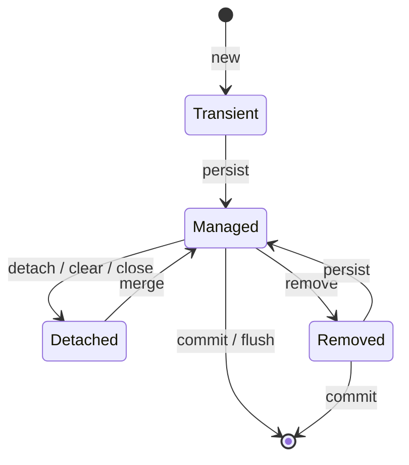

## JPA и Hibernate

### EntityManager

`EntityManager` — главный API JPA для работы с сущностями. Основные операции:

**Операции над Entity:**
- `persist(entity)` — добавление Entity под управление JPA (вставка);
- `merge(entity)` — обновление отсоединённой сущности;
- `remove(entity)` — удаление;
- `refresh(entity)` — обновление данных из БД;
- `detach(entity)` — удаление из управления JPA;
- `lock(entity, lockMode)` — блокирование от изменений в других потоках.

**Получение данных:**
- `find(Class, id)` — поиск по ID (немедленный запрос);
- `getReference(Class, id)` — ленивый прокси-сущности;
- `createQuery(String)` — создание JPQL-запроса;
- `createNamedQuery(String)` — именованный запрос;
- `createNativeQuery(String)` — нативный SQL-запрос.

### Жизненный цикл Entity



| Состояние | Описание |
|-----------|----------|
| **Transient (New)** | Объект создан, но не связан с сессией. Нет сгенерированного PK. |
| **Managed (Persistent)** | Объект управляется JPA, имеет PK. Изменения синхронизируются с БД. |
| **Detached** | Объект был персистентным, но сейчас не связан с сессией. Может стать персистентным через `merge()`. |
| **Removed** | Объект помечен на удаление, будет удалён после `commit()`. |

### `load()` vs `get()`

| Критерий | `get()` | `load()` |
|----------|---------|----------|
| Если объект не найден | Возвращает `null` | Выбрасывает `ObjectNotFoundException` |
| Запрос в БД | Немедленный | Отложенный (прокси) |
| Использование | Когда не уверены в существовании объекта | Когда объект точно существует |

### Кэширование

**Уровни кэша:**

1. **First-level cache** (кэш сессии) — включён по умолчанию, нельзя отключить. Кэширует сущности в рамках одной сессии (`EntityManager` / `Session`).
2. **Second-level cache** — отключён по умолчанию. Кэширует сущности между сессиями (на уровне `SessionFactory` / `EntityManagerFactory`).
3. **Query cache** — отключён по умолчанию. Кэширует результаты запросов по ключу (SQL + параметры).

**Очистка кэша сессии:**
- `evict(entity)` — удаляет конкретную сущность из кэша;
- `clear()` — очищает весь кэш сессии;
- `flush()` — синхронизирует состояние объектов с БД, но **не завершает транзакцию**.

### FetchType: Lazy vs Eager

| Связь | Default FetchType |
|-------|-------------------|
| `@OneToMany` | LAZY |
| `@ManyToOne` | EAGER |
| `@ManyToMany` | LAZY |
| `@OneToOne` | EAGER |

**Проблема N+1:**
- Выполняется 1 запрос для получения родительских сущностей;
- При доступе к ленивой коллекции выполняется N дополнительных запросов.

**Решения N+1:**
1. `JOIN FETCH` в JPQL — загружает связанные сущности одним запросом;
2. Entity Graph — определяет граф сущностей для загрузки;
3. Batch fetching — `@BatchSize(size = 50)`;
4. `@EntityGraph` с `attributePaths` — разделение на 2 запроса (сначала IDs, потом сущности с графом).

**Декартово произведение:**
- Возникает при `JOIN FETCH` нескольких коллекций в одном запросе;
- Либо при вытягивании нескольких коллекций как `EAGER`.

### JPQL (Java Persistence Query Language)

JPQL использует имена классов Entity и их атрибуты вместо имён таблиц и колонок:

```java
// Вместо SQL: SELECT * FROM users WHERE age > ?
// JPQL:
TypedQuery<User> query = em.createQuery(
    "SELECT u FROM User u WHERE u.age > :age", User.class);
query.setParameter("age", 18);
List<User> users = query.getResultList();
```

Отличия от SQL:
- Автоматический полиморфизм (запрос к суперклассу вернёт и подклассы);
- Функции `KEY()`, `VALUE()`, `ENTRY()` для Map;
- `TREAT()` для downcasting.

### `@EntityGraph`

Разделение запроса на 2 части для избежания декартова произведения:

```java
@Repository
public interface ClientRepository extends JpaRepository<ClientEntity, Long> {

    @Query("select c.id from ClientEntity c")
    Page<Long> getAllIds(Pageable pageable);

    @EntityGraph(attributePaths = {"accounts", "deposits"})
    List<ClientEntity> getAllByIdIn(List<Long> clientIds);
}

// Использование:
Page<Long> ids = clientRepository.getAllIds(PageRequest.of(0, 20));
List<ClientEntity> clients = clientRepository.getAllByIdIn(ids.getContent());
```

### `@Modifying` (Spring Data JPA)

Аннотация для методов репозитория, которые **изменяют** данные (`UPDATE`, `DELETE`, native queries). Без неё Spring Data считает метод read-only.

```java
@Repository
public interface UserRepository extends JpaRepository<User, Long> {

    @Modifying
    @Query("UPDATE User u SET u.status = :status WHERE u.id = :id")
    int updateStatus(@Param("id") Long id, @Param("status") UserStatus status);

    @Modifying
    @Query("DELETE FROM User u WHERE u.lastLogin < :date")
    int deleteInactive(@Param("date") LocalDate date);
}
```

**Особенности:**
- Требует `@Transactional` на уровне сервиса (или `@Transactional` + `@Modifying` на репозитории);
- Возвращает `int` — количество затронутых строк;
- Не работает с `Pageable` и `Sort` (native-запросы с `?` placeholders);
- При `clearAutomatically = true` очищает first-level cache после выполнения.

---

### Блокировки в JPA / Hibernate

JPA предоставляет явные уровни блокировки через `LockModeType`:

| LockModeType | Эквивалент SQL | Назначение |
|-------------|---------------|-----------|
| **NONE** | — | Отсутствие блокировки (default) |
| **OPTIMISTIC** | `version` column check | Оптимистическая блокировка при чтении |
| **OPTIMISTIC_FORCE_INCREMENT** | `version` + forced increment | Оптимистическая + инкремент версии |
| **PESSIMISTIC_READ** | `SELECT ... FOR SHARE` | Разделяемая блокировка (S-lock) |
| **PESSIMISTIC_WRITE** | `SELECT ... FOR UPDATE` | Эксклюзивная блокировка (X-lock) |
| **PESSIMISTIC_FORCE_INCREMENT** | `SELECT ... FOR UPDATE` + version | Пессимистическая + инкремент версии |

**Использование:**

```java
// При загрузке
User user = em.find(User.class, 1L, LockModeType.PESSIMISTIC_WRITE);

// В запросе
TypedQuery<Order> query = em.createQuery("SELECT o FROM Order o WHERE o.id = :id", Order.class);
query.setParameter("id", 1L);
query.setLockMode(LockModeType.PESSIMISTIC_WRITE);
Order order = query.getSingleResult();

// В Spring Data
@Lock(LockModeType.PESSIMISTIC_WRITE)
@Query("SELECT p FROM Product p WHERE p.id = :id")
Optional<Product> findByIdForUpdate(@Param("id") Long id);
```

**`SELECT ... FOR UPDATE` в Hibernate:**
- Блокирует выбранные строки до конца транзакции;
- Другие транзакции не могут изменить (и иногда даже прочитать, в зависимости от БД) эти строки;
- Применяется для предотвращения race condition при проверке/изменении баланса, остатков и т.д.

---

### MyBatis vs JPA

| Критерий | MyBatis | JPA/Hibernate |
|----------|---------|---------------|
| Подход | SQL-маппинг | ORM |
| Сущности | Не требуются | Требуются `@Entity` |
| SQL | Пишется вручную (XML/аннотации) | Генерируется автоматически |
| Гибкость | Полный контроль над SQL | Абстракция от БД |
| Код | Меньше бойлерплейта для простых операций | Меньше кода для CRUD |

### LazyInitializationException

`LazyInitializationException` возникает при попытке доступа к ленивой ассоциации вне контекста persistence (после закрытия `EntityManager` / `Session` или `Transaction`).

**Причины:**
- Доступ к `@OneToMany(fetch = LAZY)` после закрытия сессии;
- Сериализация entity с неинициализированной коллекцией и последующий доступ;
- Вызов ленивого метода в представлении (view layer), когда транзакция сервиса уже завершена.

**Решения:**
1. Использовать `JOIN FETCH` или Entity Graph в запросе;
2. Инициализировать коллекцию внутри транзакции: `Hibernate.initialize(entity.getChildren())`;
3. `@Transactional` на методе сервиса, который возвращает entity (не на контроллере);
4. DTO-проекции вместо возврата Entity;
5. `OpenEntityManagerInViewFilter` / `OpenSessionInView` — антипаттерн, маскирует проблему.

---

### Наследование в Hibernate (JPA Inheritance Strategies)

Hibernate предоставляет три стратегии отображения иерархии классов на таблицы БД:

| Стратегия | Аннотация | Описание | Плюсы | Минусы |
|-----------|-----------|----------|-------|--------|
| **SINGLE_TABLE** | `@Inheritance(strategy = InheritanceType.SINGLE_TABLE)` | Одна таблица для всей иерархии. Discriminator column определяет конкретный подтип. | Простые запросы, производительность (нет JOIN) | Nullable-столбцы, разрастание таблицы |
| **JOINED** | `@Inheritance(strategy = InheritanceType.JOINED)` | Каждый класс — своя таблица. Общие поля в таблице родителя, специфичные — в таблицах дочерних. | Нормализация, отсутствие NULL | Требуется JOIN, медленнее вставка |
| **TABLE_PER_CLASS** | `@Inheritance(strategy = InheritanceType.TABLE_PER_CLASS)` | Каждый класс — своя таблица со всеми полями (включая унаследованные). | Простота, эффективный поиск по подтипу | Дублирование схемы, сложный полиморфный запрос (UNION) |

**`@MappedSuperclass`** — не стратегия наследования сущностей, но позволяет наследовать mapping (поля и аннотации) без создания отдельной таблицы для родителя. Родительский класс не является `@Entity`, поэтому не может использоваться в запросах и ассоциациях.

**SINGLE_TABLE** — одна таблица на всю иерархию:

```sql
CREATE TABLE Vehicle (
    id BIGINT PRIMARY KEY,
    dtype VARCHAR(10),        -- discriminator: CAR / BIKE
    manufacturer VARCHAR(50),
    max_speed INT,
    no_of_seats INT           -- NULL для Bike
);

INSERT INTO Vehicle VALUES (1, 'CAR',  'Toyota', 200, 5);
INSERT INTO Vehicle VALUES (2, 'BIKE', 'Honda',  180, NULL);
```

**JOINED** — общая таблица родителя + отдельные таблицы дочерних:

```sql
CREATE TABLE Vehicle (
    id BIGINT PRIMARY KEY,
    manufacturer VARCHAR(50)
);

CREATE TABLE Car (
    id BIGINT PRIMARY KEY REFERENCES Vehicle(id),
    max_speed INT,
    no_of_seats INT
);

CREATE TABLE Bike (
    id BIGINT PRIMARY KEY REFERENCES Vehicle(id),
    max_speed INT
);

INSERT INTO Vehicle VALUES (1, 'Toyota');
INSERT INTO Vehicle VALUES (2, 'Honda');
INSERT INTO Car VALUES (1, 200, 5);
INSERT INTO Bike VALUES (2, 180);
```

**TABLE_PER_CLASS** — каждый класс со своей полной таблицей:

```sql
CREATE TABLE Car (
    id BIGINT PRIMARY KEY,
    manufacturer VARCHAR(50),
    max_speed INT,
    no_of_seats INT
);

CREATE TABLE Bike (
    id BIGINT PRIMARY KEY,
    manufacturer VARCHAR(50),
    max_speed INT
);

INSERT INTO Car  VALUES (1, 'Toyota', 200, 5);
INSERT INTO Bike VALUES (2, 'Honda',  180);
```

**Рекомендации:**
- **SINGLE_TABLE** — используйте по умолчанию. Лучшая производительность для полиморфных запросов;
- **JOINED** — когда подтипы имеют много уникальных полей и важна нормализация;
- **TABLE_PER_CLASS** — редко используется, подходит когда иерархия глубокая и запросы в основном по конкретному подтипу.
