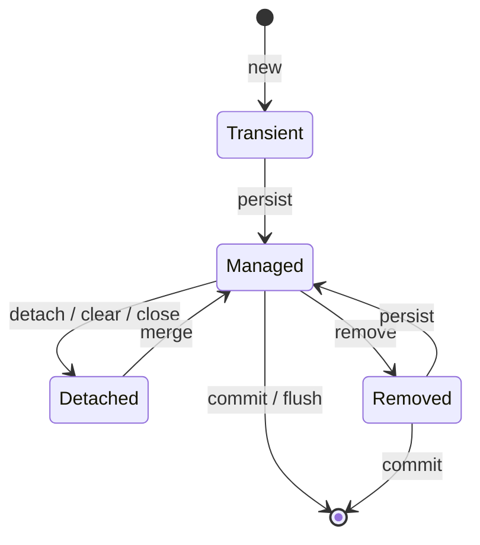
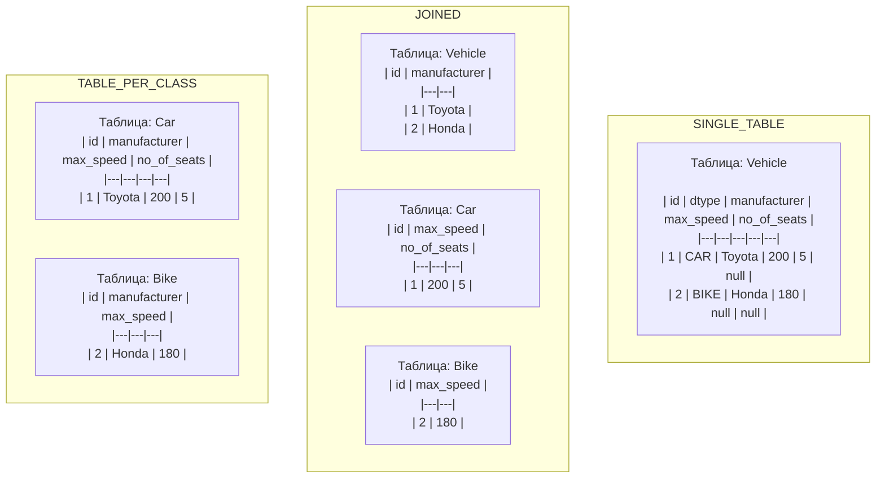

# Базы данных, JPA и Hibernate

## JPA и Hibernate

### EntityManager

`EntityManager` — главный API JPA для работы с сущностями. Основные операции:

**Операции над Entity:**
- `persist(entity)` — добавление Entity под управление JPA (вставка);
- `merge(entity)` — обновление отсоединённой сущности;
- `remove(entity)` — удаление;
- `refresh(entity)` — обновление данных из БД;
- `detach(entity)` — удаление из управления JPA;
- `lock(entity, lockMode)` — блокирование от изменений в других потоках.

**Получение данных:**
- `find(Class, id)` — поиск по ID (немедленный запрос);
- `getReference(Class, id)` — ленивый прокси-сущности;
- `createQuery(String)` — создание JPQL-запроса;
- `createNamedQuery(String)` — именованный запрос;
- `createNativeQuery(String)` — нативный SQL-запрос.

### Жизненный цикл Entity



| Состояние | Описание |
|-----------|----------|
| **Transient (New)** | Объект создан, но не связан с сессией. Нет сгенерированного PK. |
| **Managed (Persistent)** | Объект управляется JPA, имеет PK. Изменения синхронизируются с БД. |
| **Detached** | Объект был персистентным, но сейчас не связан с сессией. Может стать персистентным через `merge()`. |
| **Removed** | Объект помечен на удаление, будет удалён после `commit()`. |

### `load()` vs `get()`

| | `get()` | `load()` |
|---|---------|----------|
| Если объект не найден | Возвращает `null` | Выбрасывает `ObjectNotFoundException` |
| Запрос в БД | Немедленный | Отложенный (прокси) |
| Использование | Когда не уверены в существовании объекта | Когда объект точно существует |

### Кэширование

**Уровни кэша:**

1. **First-level cache** (кэш сессии) — включён по умолчанию, нельзя отключить. Кэширует сущности в рамках одной сессии (`EntityManager` / `Session`).
2. **Second-level cache** — отключён по умолчанию. Кэширует сущности между сессиями (на уровне `SessionFactory` / `EntityManagerFactory`).
3. **Query cache** — отключён по умолчанию. Кэширует результаты запросов по ключу (SQL + параметры).

**Очистка кэша сессии:**
- `evict(entity)` — удаляет конкретную сущность из кэша;
- `clear()` — очищает весь кэш сессии;
- `flush()` — синхронизирует состояние объектов с БД, но **не завершает транзакцию**.

### FetchType: Lazy vs Eager

| Связь | Default FetchType |
|-------|-------------------|
| `@OneToMany` | LAZY |
| `@ManyToOne` | EAGER |
| `@ManyToMany` | LAZY |
| `@OneToOne` | EAGER |

**Проблема N+1:**
- Выполняется 1 запрос для получения родительских сущностей;
- При доступе к ленивой коллекции выполняется N дополнительных запросов.

**Решения N+1:**
1. `JOIN FETCH` в JPQL — загружает связанные сущности одним запросом;
2. Entity Graph — определяет граф сущностей для загрузки;
3. Batch fetching — `@BatchSize(size = 50)`;
4. `@EntityGraph` с `attributePaths` — разделение на 2 запроса (сначала IDs, потом сущности с графом).

**Декартово произведение:**
- Возникает при `JOIN FETCH` нескольких коллекций в одном запросе;
- Либо при вытягивании нескольких коллекций как `EAGER`.

### JPQL (Java Persistence Query Language)

JPQL использует имена классов Entity и их атрибуты вместо имён таблиц и колонок:

```java
// Вместо SQL: SELECT * FROM users WHERE age > ?
// JPQL:
TypedQuery<User> query = em.createQuery(
    "SELECT u FROM User u WHERE u.age > :age", User.class);
query.setParameter("age", 18);
List<User> users = query.getResultList();
```

Отличия от SQL:
- Автоматический полиморфизм (запрос к суперклассу вернёт и подклассы);
- Функции `KEY()`, `VALUE()`, `ENTRY()` для Map;
- `TREAT()` для downcasting.

### `@EntityGraph`

Разделение запроса на 2 части для избежания декартова произведения:

```java
@Repository
public interface ClientRepository extends JpaRepository<ClientEntity, Long> {

    @Query("select c.id from ClientEntity c")
    Page<Long> getAllIds(Pageable pageable);

    @EntityGraph(attributePaths = {"accounts", "deposits"})
    List<ClientEntity> getAllByIdIn(List<Long> clientIds);
}

// Использование:
Page<Long> ids = clientRepository.getAllIds(PageRequest.of(0, 20));
List<ClientEntity> clients = clientRepository.getAllByIdIn(ids.getContent());
```

### `@Modifying` (Spring Data JPA)

Аннотация для методов репозитория, которые **изменяют** данные (`UPDATE`, `DELETE`, native queries). Без неё Spring Data считает метод read-only.

```java
@Repository
public interface UserRepository extends JpaRepository<User, Long> {

    @Modifying
    @Query("UPDATE User u SET u.status = :status WHERE u.id = :id")
    int updateStatus(@Param("id") Long id, @Param("status") UserStatus status);

    @Modifying
    @Query("DELETE FROM User u WHERE u.lastLogin < :date")
    int deleteInactive(@Param("date") LocalDate date);
}
```

**Особенности:**
- Требует `@Transactional` на уровне сервиса (или `@Transactional` + `@Modifying` на репозитории);
- Возвращает `int` — количество затронутых строк;
- Не работает с `Pageable` и `Sort` (native-запросы с `?` placeholders);
- При `clearAutomatically = true` очищает first-level cache после выполнения.

---

### Блокировки в JPA / Hibernate

JPA предоставляет явные уровни блокировки через `LockModeType`:

| LockModeType | Эквивалент SQL | Назначение |
|-------------|---------------|-----------|
| **NONE** | — | Отсутствие блокировки (default) |
| **OPTIMISTIC** | `version` column check | Оптимистическая блокировка при чтении |
| **OPTIMISTIC_FORCE_INCREMENT** | `version` + forced increment | Оптимистическая + инкремент версии |
| **PESSIMISTIC_READ** | `SELECT ... FOR SHARE` | Разделяемая блокировка (S-lock) |
| **PESSIMISTIC_WRITE** | `SELECT ... FOR UPDATE` | Эксклюзивная блокировка (X-lock) |
| **PESSIMISTIC_FORCE_INCREMENT** | `SELECT ... FOR UPDATE` + version | Пессимистическая + инкремент версии |

**Использование:**

```java
// При загрузке
User user = em.find(User.class, 1L, LockModeType.PESSIMISTIC_WRITE);

// В запросе
TypedQuery<Order> query = em.createQuery("SELECT o FROM Order o WHERE o.id = :id", Order.class);
query.setParameter("id", 1L);
query.setLockMode(LockModeType.PESSIMISTIC_WRITE);
Order order = query.getSingleResult();

// В Spring Data
@Lock(LockModeType.PESSIMISTIC_WRITE)
@Query("SELECT p FROM Product p WHERE p.id = :id")
Optional<Product> findByIdForUpdate(@Param("id") Long id);
```

**`SELECT ... FOR UPDATE` в Hibernate:**
- Блокирует выбранные строки до конца транзакции;
- Другие транзакции не могут изменить (и иногда даже прочитать, в зависимости от БД) эти строки;
- Применяется для предотвращения race condition при проверке/изменении баланса, остатков и т.д.

---

### MyBatis vs JPA

| | MyBatis | JPA/Hibernate |
|---|---------|---------------|
| Подход | SQL-маппинг | ORM |
| Сущности | Не требуются | Требуются `@Entity` |
| SQL | Пишется вручную (XML/аннотации) | Генерируется автоматически |
| Гибкость | Полный контроль над SQL | Абстракция от БД |
| Код | Меньше бойлерплейта для простых операций | Меньше кода для CRUD |

### LazyInitializationException

`LazyInitializationException` возникает при попытке доступа к ленивой ассоциации вне контекста persistence (после закрытия `EntityManager` / `Session` или `Transaction`).

**Причины:**
- Доступ к `@OneToMany(fetch = LAZY)` после закрытия сессии;
- Сериализация entity с неинициализированной коллекцией и последующий доступ;
- Вызов ленивого метода в представлении (view layer), когда транзакция сервиса уже завершена.

**Решения:**
1. Использовать `JOIN FETCH` или Entity Graph в запросе;
2. Инициализировать коллекцию внутри транзакции: `Hibernate.initialize(entity.getChildren())`;
3. `@Transactional` на методе сервиса, который возвращает entity (не на контроллере);
4. DTO-проекции вместо возврата Entity;
5. `OpenEntityManagerInViewFilter` / `OpenSessionInView` — антипаттерн, маскирует проблему.

---

### HikariCP

HikariCP — высокопроизводительный пул соединений JDBC, используемый по умолчанию в Spring Boot.

**Преимущества:**
- Быстрее c3p0, DBCP, Tomcat JDBC Pool;
- Минимальный оверхед;
- Проверка соединений в фоне (`connectionTestQuery` не требуется для JDBC 4+).

**Ключевые настройки:**

```yaml
spring:
  datasource:
    hikari:
      maximum-pool-size: 20      # Макс. соединений в пуле
      minimum-idle: 5            # Мин. незанятых соединений
      connection-timeout: 30000  # Макс. время ожидания соединения (ms)
      idle-timeout: 600000       # Время жизни незанятого соединения (ms)
      max-lifetime: 1800000    # Макс. время жизни соединения (ms)
      leak-detection-threshold: 60000  # Диагностика утечек
```

**Правило:** `maximum-pool-size` должен быть меньше или равен максимальному количеству соединений, которое может обработать БД, иначе возникнут блокировки.

---

### OLAP vs OLTP

| | OLTP (Online Transaction Processing) | OLAP (Online Analytical Processing) |
|---|--------------------------------------|-----------------------------------|
| **Назначение** | Операционная обработка транзакций | Аналитика, отчётность, data mining |
| **Характер запросов** | Простые, короткие (CRUD) | Сложные, агрегирующие, сканирующие большие объёмы |
| **Данные** | Текущие, детальные | Исторические, агрегированные |
| **Нормализация** | Высокая (3NF+) | Низкая (денормализация, звёздная схема) |
| **Примеры систем** | CRM, ERP, банковские транзакции | Data Warehouse, BI-отчёты |
| **Базы данных** | PostgreSQL, MySQL, Oracle | ClickHouse, Apache Druid, Snowflake |

---

### Наследование в Hibernate (JPA Inheritance Strategies)

Hibernate предоставляет три стратегии отображения иерархии классов на таблицы БД:

| Стратегия | Аннотация | Описание | Плюсы | Минусы |
|-----------|-----------|----------|-------|--------|
| **SINGLE_TABLE** | `@Inheritance(strategy = InheritanceType.SINGLE_TABLE)` | Одна таблица для всей иерархии. Discriminator column определяет конкретный подтип. | Простые запросы, производительность (нет JOIN) | Nullable-столбцы, разрастание таблицы |
| **JOINED** | `@Inheritance(strategy = InheritanceType.JOINED)` | Каждый класс — своя таблица. Общие поля в таблице родителя, специфичные — в таблицах дочерних. | Нормализация, отсутствие NULL | Требуется JOIN, медленнее вставка |
| **TABLE_PER_CLASS** | `@Inheritance(strategy = InheritanceType.TABLE_PER_CLASS)` | Каждый класс — своя таблица со всеми полями (включая унаследованные). | Простота, эффективный поиск по подтипу | Дублирование схемы, сложный полиморфный запрос (UNION) |

**`@MappedSuperclass`** — не стратегия наследования сущностей, но позволяет наследовать mapping (поля и аннотации) без создания отдельной таблицы для родителя. Родительский класс не является `@Entity`, поэтому не может использоваться в запросах и ассоциациях.



**Рекомендации:**
- **SINGLE_TABLE** — используйте по умолчанию. Лучшая производительность для полиморфных запросов;
- **JOINED** — когда подтипы имеют много уникальных полей и важна нормализация;
- **TABLE_PER_CLASS** — редко используется, подходит когда иерархия глубокая и запросы в основном по конкретному подтипу.

---

## SQL и реляционные базы данных

### Типы индексов

Индекс — структура данных для повышения скорости поиска. Наиболее популярные реализации — B-деревья и хеш-таблицы.

**PostgreSQL:**

| Тип | Описание | Применение |
|-----|----------|------------|
| **B-tree** (default) | Сбалансированное дерево | Операторы сравнения (`=`, `>`, `<`, `BETWEEN`, `LIKE 'abc%'`). Поддерживает уникальность. |
| **Hash** | Хеш-таблица | Только `=`. Не поддерживает уникальные столбцы. Обычно выигрывает B-tree при сравнении через равно. |
| **GiST** | Generalized Search Tree | Геометрические типы, диапазоны, полнотекстовый поиск. |
| **GIN** | Generalized Inverted Index | Полнотекстовый поиск, массивы, JSONB. |
| **BRIN** | Block Range Index | Большие таблицы с естественным порядком (timestamp, ID). Компактный. |

**Кластеризованный vs Некластеризованный:**
- **Кластеризованный** — данные физически упорядочены на диске. Минус: сортировка при обновлении. Только один на таблицу.
- **Некластеризованный** — отдельная структура с указателями на данные. Может быть несколько.

### Составные индексы

При создании составного индекса важен **порядок столбцов**:
- Первым должно идти поле с самой высокой селективностью (больше уникальных значений);
- Индекс `CREATE INDEX idx ON table (a, b, c)` будет использован для запросов:
  - `WHERE a = 1`
  - `WHERE a = 1 AND b = 2`
  - `WHERE a = 1 AND b = 2 AND c = 3`
  - `WHERE a = 1 AND c = 3` (только по `a`)
- НЕ будет использован для: `WHERE b = 2`, `WHERE c = 3`, `WHERE b = 2 AND c = 3`.

### JOIN

| Тип JOIN | Результат |
|----------|-----------|
| **INNER JOIN** | Строки, имеющие совпадения в обеих таблицах |
| **LEFT JOIN** | Все строки из левой таблицы + совпадающие из правой (NULL где нет совпадений) |
| **RIGHT JOIN** | Все строки из правой таблицы + совпадающие из левой |
| **FULL JOIN** | Все строки из обеих таблиц (NULL где нет совпадений) |
| **CROSS JOIN** | Декартово произведение — все комбинации строк |

### Транзакции

**ACID:**
- **Atomicity** — атомарность: транзакция либо выполняется полностью, либо не выполняется вовсе;
- **Consistency** — согласованность: транзакция переводит БД из одного согласованного состояния в другое;
- **Isolation** — изоляция: результаты незавершённой транзакции не видны другим;
- **Durability** — долговечность: результаты сохраняются даже при сбоях.

**Уровни изоляции (от меньшей к большей изоляции):**

| Уровень | Грязное чтение | Неповторяющееся чтение | Фантомы |
|---------|---------------|------------------------|---------|
| READ UNCOMMITTED | Да | Да | Да |
| READ COMMITTED | Нет | Да | Да |
| REPEATABLE READ | Нет | Нет | Да |
| SERIALIZABLE | Нет | Нет | Нет |

- **MySQL default**: `REPEATABLE READ`
- **PostgreSQL default**: `READ COMMITTED`

**Проблемы параллельного выполнения:**
1. **Dirty read** — чтение незафиксированных данных;
2. **Non-repeatable read** — при повторном чтении строка изменилась;
3. **Phantom read** — при повторном чтении появились новые строки.

### Блокировки

**Пессимистическая блокировка:**
- Блокировка строки/таблицы на время транзакции;
- `SELECT ... FOR UPDATE` — блокировка строк для чтения;
- `SELECT ... FOR SHARE` — разделяемая блокировка;
- Гарантирует отсутствие конфликтов, но снижает параллелизм.

**Оптимистическая блокировка:**
- Нет физической блокировки;
- Проверка версии при коммите (`@Version` / `version` поле);
- Если версия изменилась — `OptimisticLockException`;
- Подходит при низкой вероятности конфликтов.

**Дедлок (Deadlock):**
- Взаимная блокировка транзакций;
- Пример: Т1 захватила A, ждёт B; Т2 захватила B, ждёт A;
- Решение: упорядоченное получение блокировок, `tryLock()` с таймаутом.

### План выполнения запроса

```sql
EXPLAIN ANALYZE SELECT * FROM users WHERE email = 'test@example.com';
```

- `EXPLAIN` — показывает план без выполнения;
- `EXPLAIN ANALYZE` — выполняет запрос и показывает реальные времена и количество строк.

### Оконные функции

```sql
SELECT
    id,
    price,
    AVG(price) OVER (PARTITION BY category_id) as avg_category_price,
    ROW_NUMBER() OVER (PARTITION BY category_id ORDER BY price DESC) as rank
FROM products;
```

Оконные функции вычисляют значение для каждой строки на основе набора строк (окна), не требуя `GROUP BY`.

### Представления (Views) и материализованные представления

- **View** — виртуальная таблица на основе SQL-запроса. Данные не хранятся, запрос выполняется при каждом обращении;
- **Materialized View** — хранит результат запроса физически. Требует обновления (`REFRESH`).

### Хранимые процедуры

Набор SQL-операторов, сохранённых на сервере и выполняемых как единый вызов:
- Улучшают производительность (предкомпилированные);
- Снижают сетевой трафик;
- Инкапсулируют бизнес-логику на уровне БД.

### Сиквенсы (Sequences)

Механизм генерации уникальных значений:
- `SERIAL` / `BIGSERIAL` в PostgreSQL — автоинкремент на основе sequence;
- `AUTO_INCREMENT` в MySQL.

### Суррогатный ключ

Искусственно созданный столбец для обеспечения уникальности записи:
- Не несёт бизнес-смысла (например, автоинкремент `id`);
- Отличается от естественного ключа (email, ИНН и т.д.).

### Репликация и шардинг

| | Репликация | Шардинг |
|---|-----------|---------|
| **Назначение** | Отказоустойчивость, чтение | Масштабирование записи |
| **Принцип** | Копия данных на несколько серверов | Разделение данных по серверам |
| **Типы** | Master-Slave, Master-Master | Horizontal partitioning |

### Нормализация и денормализация

**Нормализация** — уменьшение избыточности, разделение таблиц:
- 1NF — атомарные значения;
- 2NF — нет частичных зависимостей от составного ключа;
- 3NF — нет транзитивных зависимостей.

**Денормализация** — объединение таблиц для улучшения производительности чтения за счёт уменьшения JOIN.

### NoSQL: принципы BASE

В отличие от ACID, NoSQL-системы часто следуют принципу BASE:
- **Basically Available** — базовая доступность (система отвечает на запросы);
- **Soft state** — состояние может меняться без внешнего вмешательства (из-за репликации);
- **Eventually consistent** — в конечном счёте согласованность (данные станут согласованными через время).

**Типы NoSQL:**
- **Документные** — MongoDB (JSON-подобные документы);
- **Ключ-значение** — Redis;
- **Столбцовые** — Cassandra;
- **Графовые** — Neo4j.

---

## Liquibase

Liquibase — система управления миграциями схемы БД.

### Основные концепции

- **ChangeLog** — файл с описанием изменений (XML, YAML, JSON, SQL);
- **ChangeSet** — единица изменения, аналог коммита. Имеет составной ID: `id`, `author`, `filename`;
- **databasechangelog** — таблица с историей выполненных changeSet;
- **databasechangelock** — таблица для блокировки при параллельном запуске.

### Контрольная сумма

Liquibase вычисляет MD5-хэш каждого changeSet. **Нельзя изменять уже выполненный changeSet** — это приведёт к ошибке при старте.

### Откат

- `rollbackCount N` — откат N последних changeSet;
- `rollback TAG` — откат до указанного тега;
- Некоторые операции требуют явного описания rollback-логики в changeSet.

### Spring Boot интеграция

```yaml
spring:
  liquibase:
    change-log: classpath:db/changelog/db.changelog-master.xml
  jpa:
    hibernate:
      ddl-auto: none
```

---

## MySQL: движки хранения

| Движок | Транзакции | Блокировка | Назначение |
|--------|-----------|------------|------------|
| **InnoDB** | Да | Строковая | Транзакционные приложения, дефолт с MySQL 5.5+ |
| **MyISAM** | Нет | Табличная | Только чтение, полнотекстовый поиск |
| **MEMORY** | Нет | Табличная | Временные таблицы в RAM |
| **Archive** | Нет | Строковая | Хранение больших объёмов без индексов |
| **NDB** | Да | Строковая | MySQL Cluster, высокая доступность |
