## ООП

1. Наследование — абстрактный тип данных может наследовать данные и функциональность существующего типа, что способствует повторному использованию кода.
2. Инкапсуляция — сокрытие реализации и предоставление только необходимого интерфейса.
3. Полиморфизм — разные объекты могут реагировать на один и тот же запрос, проявляя разное поведение в зависимости от своего типа.
4. Абстракция — выделение значимых характеристик объекта при игнорировании несущественных деталей.

---
## GRASP

GRASP — 9 принципов:
1. **Information Expert** — ответственность у того, кто владеет информацией.
2. **Creator** — создаёт тот, кто использует / агрегирует / знает, как инициализировать.
3. **Controller** — посредник между UI и бизнес-логикой.
4. **Low Coupling** — слабая связанность между объектами.
5. **High Cohesion (Высокая сцепленность) — объект должен быть сфокусирован на одной задаче. Пример: вместо класса `Data` с методами для времени и температуры — разделить на `TimeData` и `TemperatureData`.

6. **Pure Fabrication** — искусственный класс для высокой сцепленности.
7. **Indirection** — посредник для снижения связанности.
8. **Protected Variations** — абстракции скрывают изменяемые части.
9. **Polymorphism** — обработка разных типов через общий интерфейс.

---
## Контракт `equals()` и `hashCode()`

Если два объекта равны согласно `equals()`, то их `hashCode()` обязательно должен быть одинаковым. Это необходимо для корректной работы в хеш-коллекциях.

Метод `equals()` должен соблюдать следующие свойства:
- рефлексивность: `a.equals(a)` всегда возвращает `true`;
- симметричность: `a.equals(b)` ⇔ `b.equals(a)`;
- транзитивность: если `a.equals(b)` и `b.equals(c)`, то `a.equals(c)`;
- консистентность: многократные вызовы с теми же аргументами дают одинаковый результат;
- обработка `null`: `a.equals(null)` всегда должно возвращать `false`.

### Реализация `equals()`

1. С использованием `getClass()` (точное совпадение классов):
	- используется строгая проверка на класс;
	- `Person` не будет равен `Student`, даже если `Student` наследует `Person`.

Пример:

```java
@Override
public boolean equals(Object o) {
  if (this == o) return true;
  if (o == null || getClass() != o.getClass()) return false;
  Person person = (Person) o;
  return age == person.age && Objects.equals(name, person.name);
}
```

2. С использованием `instanceof` (допускает сравнение с подклассами):
	- допускается сравнение объектов родительского и дочернего классов;
	- подходит для иерархий, где логика сравнения остаётся совместимой.

Пример:

```java
@Override
public boolean equals(Object o) {
  if (this == o) return true;
  if (!(o instanceof Person)) return false;
  Person person = (Person) o;
  return age == person.age && Objects.equals(name, person.name);
}
```

### Реализация `hashCode()`

1. Рекомендуется использовать стратегию из Effective Java:

```java
@Override
public int hashCode() {
  int result = 17;
  result = 31 * result + name.hashCode();
  result = 31 * result + (int)(phone ^ (phone >>> 32));
  result = 31 * result + age;
  return result;
}
```

2. Также можно использовать упрощённый способ:

```java
@Override
public int hashCode() {
  return Objects.hash(name, phone, age);
}
```

Практические рекомендации:
- всегда переопределяйте `hashCode()` при переопределении `equals()`;
- используйте одни и те же поля для обоих методов;
- обеспечьте устойчивое распределение хешей для минимизации коллизий.

Контракт:
1. если два объекта равны по `equals()`, их `hashCode()` должен быть одинаковым;
2. обратное не обязательно: разные объекты могут иметь одинаковый `hashCode()` (коллизия);
3. если `equals()` переопределён без `hashCode()`, хеш-коллекции могут работать некорректно.

---
## Статическое и динамическое связывание в Java

Связывание (binding) — это процесс сопоставления вызова метода с его конкретной реализацией в коде.

### Типы связывания

1. Статическое связывание (early binding) — осуществляется во время компиляции и опирается на тип ссылочной переменной. Используется для `static`, `final`, `private` методов, а также при перегрузке методов (method overloading). Компилятор заранее знает, какой именно метод будет вызван.
2. Динамическое связывание (late binding) — происходит во время выполнения и зависит от реального типа объекта в памяти. Применяется для переопределённых (`overridden`) экземплярных методов. Решение о том, какую реализацию метода вызвать, принимается JVM в момент вызова.

Виртуальный метод — это экземплярный метод, который может быть переопределён в подклассе. Вызов такого метода выполняется через динамическое связывание, позволяя реализовать полиморфизм.

---
## Коллекции

Иерархия коллекций:

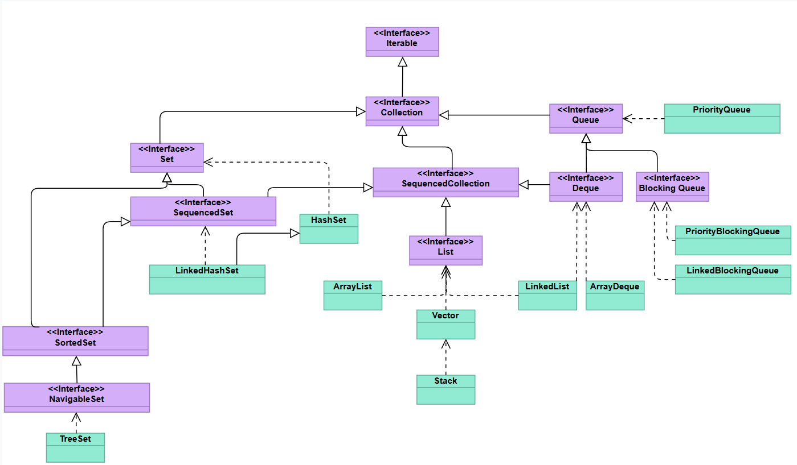

`Map` — ассоциативный массив:

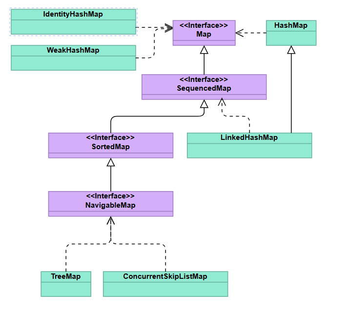

Коллекции со сортировкой: `TreeMap`, `TreeSet`, `PriorityQueue`
Коллекции со сортировкой по вставке: `LinkedHashMap`, `LinkedHashSet`

### ArrayList

`ArrayList` — расширенная версия массива.

Недостатки обычных массивов:
- фиксированный размер — нужно заранее знать, сколько элементов будет;
- нет встроенных методов для добавления и удаления — все операции выполняются вручную.

Преимущества `ArrayList`:
- автоматически расширяется при добавлении новых элементов;
- работает с объектами, как и массив, но предоставляет более гибкий и удобный интерфейс;
- можно легко добавлять, заменять, удалять элементы, узнавать их позиции и количество;
- в отличие от массива, при выводе используется переопределённый `toString()`, что делает вывод удобным.

Преобразование между массивом и `ArrayList`:
- из массива в список: `new ArrayList<>(Arrays.asList(array))`;
- из списка в массив: `list.toArray(new Cat[0])`.

Дополнительные особенности:
- можно указать начальную вместимость при создании, но список всё равно будет расширяться при необходимости;
- в отличие от свойства `length` у массива, метод `size()` у ArrayList возвращает текущее количество элементов, а не ёмкость.
#### Внутреннее устройство

`ArrayList` внутри использует обычный массив, но:
- при заполнении создаёт новый массив размером `(старый * 1.5) + 1`.
- копирует все элементы в него;
- старый удаляется сборщиком мусора.

### LinkedList

LinkedList в Java — двусвязный список. Он удобен для задач, связанных с частыми вставками и удалениями в середине списка.

Строение LinkedList:
- это двусвязный список: каждый элемент содержит ссылки на предыдущий и следующий;
- элементы объединены в цепочку, по которой можно двигаться в обоих направлениях;
- в отличие от `ArrayList`, внутри `LinkedList` нет массива — он работает исключительно со ссылками.

Отличие от ArrayList:
- в `ArrayList` операции вставки и удаления требуют сдвига элементов, особенно в середине. В `LinkedList` — лишь перенастройка ссылок;
- `ArrayList` эффективен для быстрого доступа по индексу и добавления в конец. `LinkedList` — при частом добавлении и удалении в начале или середине списка.

#### Практическое сравнение

Вставка 100 элементов в середину:

```text
LinkedList: ~1800 мс
ArrayList: ~180 мс
```

Хотя `LinkedList` должен быть эффективнее, `ArrayList` оказался быстрее из-за следующих факторов:
- доступ по индексу у `ArrayList` — мгновенный (через массив);
- в `LinkedList` нужно последовательно пройти к нужному элементу по ссылкам.
Но при вставке в начало:

```text
LinkedList: ~100 мс
ArrayList: ~43000 мс
```

Здесь `LinkedList` оказался в сотни раз быстрее — ему не нужно сдвигать элементы.

### HashMap

Хеш-таблица – структура данных, реализующая интерфейс ассоциативного массива ("ключ–значение"). Элементы хранятся в массиве, где позиция определяется хеш-функцией. Хеш-функция преобразует ключ в целое число (хеш-код), которое затем используется для вычисления индекса в массиве. Важно: хеш-функция должна быть консистентной (одинаковые ключи → одинаковый хеш). 

Внутреннее устройство `HashMap` — массив (`Node<K,V>[] table`) односвязных списков или красно-черных деревьев (для борьбы с коллизиями).

Коллизии возникают, когда разные ключи попадают в один бакет. Решаются методами: 
- метод цепочек (в одном бакете хранится связный список или дерево);
- открытая адресация (поиск следующей свободной ячейки, не используется в HashMap). 

Поля класса HashMap: 
- `transient Node<K,V>[] table` – массив бакетов;
- `int size` – количество элементов;
- `float loadFactor` – коэффициент загрузки (по умолчанию 0.75); 
- `int threshold` – порог увеличения размера (`capacity * loadFactor`). 

Константы: 
- `DEFAULT_INITIAL_CAPACITY = 16` (начальный размер);
- `TREEIFY_THRESHOLD = 8` – переход списка в дерево;
- `UNTREEIFY_THRESHOLD = 6` – обратный переход;
- `MIN_TREEIFY_CAPACITY = 64` – минимальный размер для дерева. 

Алгоритм работы при добавлении элементов: 
1. вычисление хеша: `hash = (key == null) ? 0 : (h = key.hashCode()) ^ (h >>> 16)` (смешивание старших и младших бит);
2. определение бакета: `index = (n - 1) & hash`, где `n` – размер массива;
3. проверка бакета: 
	- если бакет пуст – создается новый `Node`;
	- если есть коллизия: 
		- ключи сравниваются через `hashCode()` и `equals()`;
		- при совпадении – значение перезаписывается;
		- иначе элемент добавляется в конец списка или дерева. 
4. если `size > threshold`, вызывается `resize()` (удвоение размера + перехеширование).

Весь цикл вставки:

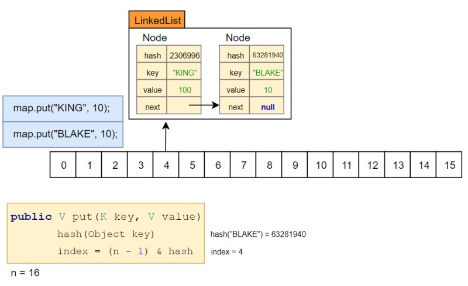

Алгоритм работы при получении элементов: 
1. вычисление хеша ключа;
2. поиск в бакете:
	- если элемент один – проверка ключа;
	- если список/дерево – последовательный обход. 
3. для деревьев используется `getTreeNode()` с поиском по хешам и `compareTo()`. 

Условия для дерева: 
- если в бакете ≥8 элементов и размер таблицы ≥64, список преобразуется в красно-черное дерево (для сохранения производительности `O(log n)`); 
- балансировка дерева происходит при вставке/удалении;
- при уменьшении элементов в бакете до 6 дерево преобразуется обратно в список. 

Красно-черное дерево:

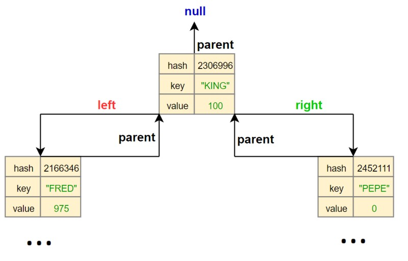

Красно-черное дерево в `HashMap`:


Важные особенности:
- порядок элементов не гарантируется;
- инициализация таблицы происходит при первом `put()`; 
- null-ключи хранятся в бакете `0`. 

Производительность: 
- в среднем: O(1) для `put()`, `get()`, `remove()`;
- в худшем случае (все элементы в одном бакете): O(n) для списка, O(log n) для дерева. 

### TreeMap

TreeMap — реализация интерфейса `NavigableMap`, хранящая элементы в отсортированном порядке. Основана на красно-чёрном дереве, что обеспечивает сортировку и логарифмическое время доступа.
 
Сравнение `TreeMap`, `HashMap` и `LinkedHashMap`:

| Свойство | HashMap | LinkedHashMap | TreeMap |
| ----------------------- | --------- | -------------------- | ------------------------------------------ |
| Порядок хранения | Случайный | В порядке добавления | В порядке возрастания (или по компаратору) |
| Время доступа | O(1) | O(1) | O(log(n)) |
| Интерфейсы | Map | Map | NavigableMap, SortedMap, Map |
| Структура данных | Корзины | Корзины | Красно-чёрное дерево |
| Поддержка `null` ключей | Да | Да | Только с компаратором |
| Потокобезопасность | Нет | Нет | Нет |

Основные характеристики красно-чёрного дерева:
- каждый узел окрашен в красный или чёрный цвет;
- корень всегда чёрный;
- все листья (null-узлы) считаются чёрными;
- если узел красный, то оба его дочерних узла — чёрные (нет двух красных подряд);
- на любом пути от узла до листа число чёрных узлов одинаково (чёрная высота).

Цвета используются для поддержания баланса дерева во время операций вставки и удаления:
- балансировка гарантирует, что дерево не превратится в "вырожденный" список;
- это позволяет сохранять логарифмическую сложность операций.

Строение:
- каждый элемент — это узел дерева;
- узлы связаны бинарными ссылками: левый ребёнок хранит ключи меньше текущего, правый ребёнок — больше;
- благодаря этому упорядоченному размещению можно быстро искать нужный ключ, сравнивая его с текущим узлом и переходя налево или направо.

### ConcurrentModificationException

Если коллекция изменяется во время итерации (например, с помощью `iterator()`), а она не поддерживает модификации на ходу (например, `ArrayList`).

Исключение не возникает:
- при использовании методов, вроде `putIfAbsent()`, у потокобезопасных коллекций (`ConcurrentHashMap` и др.);
- при вызове `size()` на коллекции, модифицированной параллельно, может быть возвращено неточное значение.

Особенности ConcurrentHashMap:
- потокобезопасная реализация `Map`, добавлена в JDK 1.5;
- имеет высокую степень параллелизма по сравнению с `Collections.synchronizedMap`;
- внутри разделена на сегменты (до JDK 1.8) или таблицы/бинов (после JDK 1.8);
- при блокировке изменяется только нужный сегмент или корзина, а не вся структура (мелкозернистая блокировка → высокая масштабируемость).

---
## Принцип Fail Fast!

Есть три подхода к ошибкам:
- Ignore! — игнорировать ошибки (плохо, опасно);
- Fail Fast! — немедленно остановить работу при ошибке (лучше на этапе разработки);
- Fail Safe! — обработать ошибку и продолжить работу (важно в критичных системах и продакшене).

> Fail Fast на этапе разработки; Fail Safe или гибрид — в критичных системах (медицина, банки, космос).

---
## Исключения

Типы ошибок:


Блок `finally` всегда выполняется перед оператором `return` из других блоков, поэтому он может вернуть значение раньше, чем будет выброшена ошибка. Однако `finally` не выполнится в следующих случаях:
- произойдет завершение работы JVM, например, при вызове `System.exit(0)` или при остановке системы (halt);
- возникнет критическая ошибка, которую JVM не в состоянии обработать, например, `StackOverflowError` или `OutOfMemoryError`;
- в блоках `try` или `catch` возникнет бесконечный цикл, из-за которого поток не сможет дойти до `finally`;
- если поток является daemon-потоком, который может быть завершён JVM без выполнения `finally`.

`try-with-resources` — автоматическое закрытие `AutoCloseable` ресурсов.

```java
try (ResourceType r = new ResourceType()) { ... }
```

`UncaughtExceptionHandler` — обработчик непойманных исключений в потоках.
- `thread.setUncaughtExceptionHandler(handler)` — для конкретного потока;
- `Thread.setDefaultUncaughtExceptionHandler(handler)` — глобально.

---
## Базовая многопоточность 

`Thread Dump` — это снимок всех потоков, запущенных в JVM в определённый момент времени. Он показывает их состояние, стек вызовов и может помочь найти причины зависаний, утечек, блокировок и других проблем.

Используется для следующих сценариев:
- при анализе "зависших" приложений;
- при поиске deadlock'ов;
- при оптимизации многопоточности;
- при анализе производительности.

Содержит:
- имя потока;
- статус: `RUNNABLE`, `WAITING`, `TIMED_WAITING`, `BLOCKED`;
- стек вызовов (stack trace);
- информация о блокировках (мониторах).

Пример:

```text
"main" #1 prio=5 os_prio=31 tid=0x00007ffee5b0c000 nid=0x1a03 runnable [0x0000700000c37000]
 java.lang.Thread.State: RUNNABLE
 at com.example.MyClass.method(MyClass.java:42)
```

`ThreadLocal<T>` — это специальный класс, позволяющий каждому потоку хранить собственное значение переменной. То есть, каждый поток работает со своей копией.

Нужен по следующим причинам:
- изоляция данных между потоками;
- хранение пользовательских сессий, транзакций, контекста;
- работа с не-потокобезопасными объектами (например, `SimpleDateFormat`).

Пример:

```java
public class MyClass {
  private static final ThreadLocal < Integer > threadLocal = ThreadLocal.withInitial(() -> 0);

  public void increment() {
    threadLocal.set(threadLocal.get() + 1);
  }

  public int get() {
    return threadLocal.get();
  }
}
```

Особенности:
- значение `ThreadLocal` доступно только в текущем потоке;
- утечки памяти возможны при неправильном использовании (например, в `ThreadPool`);
- удаление значения вручную `threadLocal.remove()`.

Различие между `Callable` и `Runnable`:
1. `Callable` реализует метод `call()`, тогда как `Runnable` реализует метод `run()`;
2. `Callable` способен возвращать результат выполнения, в отличие от `Runnable`, который не возвращает значения;
3. `Callable` может выбрасывать проверяемые исключения (`checked exceptions`), а `Runnable` — нет;
4. `Callable` можно использовать с методами `invokeAny()` и `invokeAll()` интерфейса `ExecutorService`, тогда как `Runnable` с ними не совместим.

### Executors

Java предлагает фабричные методы в классе `Executors` для создания различных видов пулов потоков:
- `newSingleThreadExecutor()` — пул с одним потоком;
- `newFixedThreadPool(int nThreads)` — пул с фиксированным числом потоков;
- `newCachedThreadPool()` — динамически растущий пул, повторно использующий потоки;
- `newScheduledThreadPool(int corePoolSize)` — пул с поддержкой планирования задач по времени.

Лучше не создавать потоки вручную — количество ограничено ОС (~4000 на macOS), при превышении `OutOfMemoryError`.

С Java 19 `ExecutorService` реализует `AutoCloseable`:

```java
try (var executor = Executors.newFixedThreadPool(4)) {
    // работаем с пулом
} // shutdown() + awaitTermination() автоматически
```

### CAS (Compare And Swap)

CAS — неблокирующий механизм обновления значения переменной, который используется в `Atomic` классах. Применяется в `AtomicInteger`, `ConcurrentHashMap`, `CopyOnWriteArrayList` и др. Работает по схеме:
1. сравнивает текущее значение с ожидаемым;
2. если совпадает — меняет значение;
3. иначе — повторяет попытку.

Различие между мьютекс и монитор заключается в следующем:
- в Java термин монитор означает встроенный механизм синхронизации (`synchronized`);
- мьютекс (mutual exclusion) — более общий термин из многопоточности;
- в контексте Java монитор = мьютекс, реализованный на уровне JVM.

Жизненный цикл потока:


Основные понятия многопоточности:
- **Процесс** — изолированный экземпляр программы со своим адресным пространством;
- **Поток** — легковесная единица внутри процесса, разделяет ресурсы процесса;
- **Синхронизация** — управление одновременным доступом к общим ресурсам;
- **Монитор** — механизм взаимного исключения, связанный с каждым объектом (`synchronized`);
- **Критическая секция** — участок кода с операциями над общими ресурсами, требующий захвата монитора.

Synchronized — это ключевое слово в Java, которое используется для синхронизации потоков. Когда метод или блок кода помечается как synchronized, это означает, что только один поток может выполнять данный метод или блок кода на объекте в определенный момент времени.

Потоки делают следующее:
- повышение производительности (распределение задач); 
- улучшение отзывчивости (неблокирующий UI); 
- оптимизация пользовательского опыта. 

Преимущества многопоточности:
- конкурентность и параллелизм; 
- масштабируемость; 
- отказоустойчивость (сбой в одном потоке ≠ крах приложения). 

Ключевые механизмы синхронизации:
- `synchronized` – гарантирует, что только один поток выполняет блок/метод. Решает проблему Race Condition. 

Синтаксис:

 ```java
 public synchronized void increment() { counter++; }
 ```

- `volatile` – обеспечивает видимость изменений переменной для всех потоков. 

Синтаксис:

 ```java
 private volatile boolean flag = false;
 ```
 
- Монитор и критические секции – контроль доступа к общим ресурсам. 

### Способы создания потоков

#### 1. Наследование от `Thread` 

```java
class MyThread extends Thread {
  public void run() { /* код */ }
}
new MyThread().start();
```

Методы: `sleep()`, `join()`, `yield()`.

#### 2. `Runnable`

```java
class MyRunnable implements Runnable {
  public void run() { /* код */ }
}
new Thread(new MyRunnable()).start();
```

Гибкость — нет ограничения одиночного наследования.

#### 3. `Callable` + `Future`

```java
Callable<Integer> task = () -> 42;
Future<Integer> future = executor.submit(task);
Integer result = future.get(); // блокирующий
```

#### 4. `CompletableFuture` (Java 8+)

```java
CompletableFuture.supplyAsync(() -> "Hello")
  .thenApply(s -> s + " World")
  .thenAccept(System.out::println);
```

#### 5. `Executors` и пулы потоков 

Синтаксис:

```java
ExecutorService executor = Executors.newFixedThreadPool(4);
executor.submit(() -> { /* задача */ });
executor.shutdown();
```

Есть несколько пулов:
- `FixedThreadPool` – фиксированное число потоков; 
- `CachedThreadPool` – масштабируемый пул;
- `ForkJoinPool` – для рекурсивных задач (разделяй и властвуй). 

Синтаксис:

```java
class MyTask extends RecursiveAction {
 protected void compute() { /* разделение задачи */ }
}
ForkJoinPool pool = new ForkJoinPool();
pool.invoke(new MyTask());
```

#### 6. `Parallel Stream` 

Параллельная обработка коллекций. 

Синтаксис:

```java
list.parallelStream().map(x -> x * 2).forEach(System.out::println);
```

#### 7. Атомарные классы (`AtomicInteger`, etc.) 

Атомарные операции без блокировок (CAS-механизм). 

Синтаксис:

```java
AtomicInteger counter = new AtomicInteger(0);
counter.incrementAndGet();
```

### Проблемы многопоточности

Существует несколько проблем многопоточности:
1. Race Condition (Состояние гонки) – это недостаток в системе, который проявляется в различных результатах в зависимости от последовательности действий участников системы (Решение: `synchronized`, атомарные классы);
2. Deadlock – взаимная блокировка потоков (Решение: Упорядоченное получение блокировок, `tryLock()`);
3. Livelock – потоки "вежливо" мешают друг другу;
4. Starvation – поток не получает ресурсы из-за жадных соседей.

Пример Deadlock:

```java
public class DeadlockExample {
  private final Object lock1 = new Object();
  private final Object lock2 = new Object();

  public void method1() {
    synchronized(lock1) {
      System.out.println("Thread 1: Holding lock1...");
      try {
        Thread.sleep(100);
      } catch (InterruptedException e) {
        e.printStackTrace();
      }
      synchronized(lock2) {
        System.out.println("Thread 1: Holding lock1 & lock2...");
      }
    }
  }

  public void method2() {
    synchronized(lock2) {
      System.out.println("Thread 2: Holding lock2...");
      try {
        Thread.sleep(100);
      } catch (InterruptedException e) {
        e.printStackTrace();
      }
      synchronized(lock1) {
        System.out.println("Thread 2: Holding lock2 & lock1...");
      }
    }
  }

  public static void main(String[] args) {
    DeadlockExample example = new DeadlockExample();

    Thread t1 = new Thread(example::method1);
    Thread t2 = new Thread(example::method2);

    t1.start();
    t2.start();
  }
}
```

### IllegalMonitorStateException

IllegalMonitorStateException в Java возникает в многопоточном программировании. Это исключение сигнализирует, что поток попытался вызвать `wait()`, `notify()` или `notifyAll()` для монитора, которым он не владеет. Проще говоря, ошибка появляется, если эти методы вызываются вне блока `synchronized`.  

---
## Пакет `java.util.concurrent`

Пакет `java.util.concurrent` включает классы и интерфейсы для многопоточного программирования, разделённые на функциональные группы:

### 1. Concurrent Collections

Потокобезопасные аналоги коллекций из `java.util`:
- [CopyOnWriteArrayList](Resources/Concurrent/CopyOnWriteArrayList.md) — потокобезопасный `ArrayList`. При изменении создаёт новую копию массива.
- [ConcurrentHashMap](Resources/Concurrent/ConcurrentHashMap.md) — аналог `HashMap` с сегментированной структурой для параллельного доступа.
- [CopyOnWriteArraySet](Resources/Concurrent/CopyOnWriteArraySet.md) — реализация `Set` на основе `CopyOnWriteArrayList`.
- ConcurrentSkipListMap/SkipListSet — аналоги `TreeMap` и `TreeSet` с поддержкой многопоточности.

Особенности:
- итераторы работают с "моментальным снимком" данных;
- не вызывают `ConcurrentModificationException`.

### 2. Synchronizers

Альтернативы базовой синхронизации (`synchronized`, `wait/notify`):
- [Semaphore](Resources/Concurrent/Semaphore.md) — ограничивает количество потоков, обращающихся к ресурсу.

Визуализация:

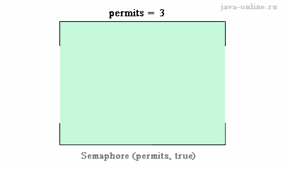

- [CountDownLatch](Resources/Concurrent/CountDownLatch.md) — блокирует потоки до выполнения заданного числа условий.

Визуализация:

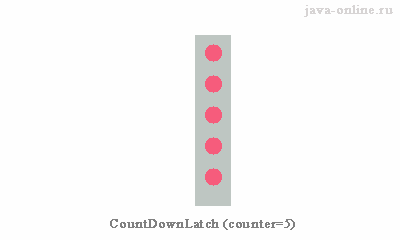

- [CyclicBarrier](Resources/Concurrent/CyclicBarrier.md) — синхронизирует потоки в точке "барьера" (многоразовый).

Визуализация:

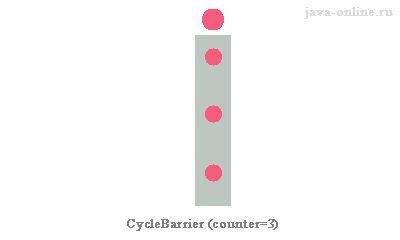

- [Exchanger](Resources/Concurrent/Exchanger.md) — обмен данными между двумя потоками.

Визуализация:

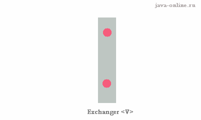

- [Phaser](Resources/Concurrent/Phaser.md) — расширенный `CyclicBarrier` с поддержкой фаз.

Визуализация:

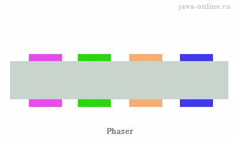

### 3. Atomic Classes

Классы для атомарных операций (без блокировок). Примеры: `AtomicInteger`, `AtomicReference`, `AtomicBoolean`.

Метод `compareAndSet` — меняет значение, только если оно соответствует ожидаемому (CAS-операция).

Применение: счётчики, флаги, обновление ссылок.

### 4. Queues

Неблокирующие (высокая производительность):
- `ConcurrentLinkedQueue` — FIFO-очередь на CAS;
- `ConcurrentLinkedDeque` — двунаправленная очередь.

Блокирующие (контроль перегрузки):
- `ArrayBlockingQueue` — очередь на массиве с фиксированной ёмкостью;
- `LinkedBlockingQueue` — очередь на связанных узлах (по умолчанию — неограниченная);
- `PriorityBlockingQueue` — очередь с приоритетами;
- `SynchronousQueue` — "точка обмена" между потоками;
- `DelayQueue` — элементы извлекаются после задержки.

### 5. Locks

Альтернативы `synchronized`:
- `Lock` — интерфейс для гибкой блокировки (например, `ReentrantLock`);
- `Condition` — аналог `wait/notify` для `Lock`;
- `ReadWriteLock` — разделяет блокировки на чтение (`readLock`) и запись (`writeLock`).

Преимущество — возможность использовать таймауты, прерывания и неблокирующие попытки.

### 6. Executors

Интерфейсы:
- `Callable` — аналог `Runnable` с возвращаемым значением;
- `Future` — результат асинхронной задачи (метод `get` блокирует поток);
- `ExecutorService` — управление пулами потоков (методы `submit`, `invokeAll`);
- `ScheduledExecutorService` — планирование задач (`ScheduledThreadPoolExecutor`).

Реализации:
- `ThreadPoolExecutor` — пул потоков с настройкой;
- `ForkJoinPool` — для задач типа "разделяй и властвуй".

Класс `Executors` — фабрики для создания пулов.

---
## JMM

Области памяти в куче:

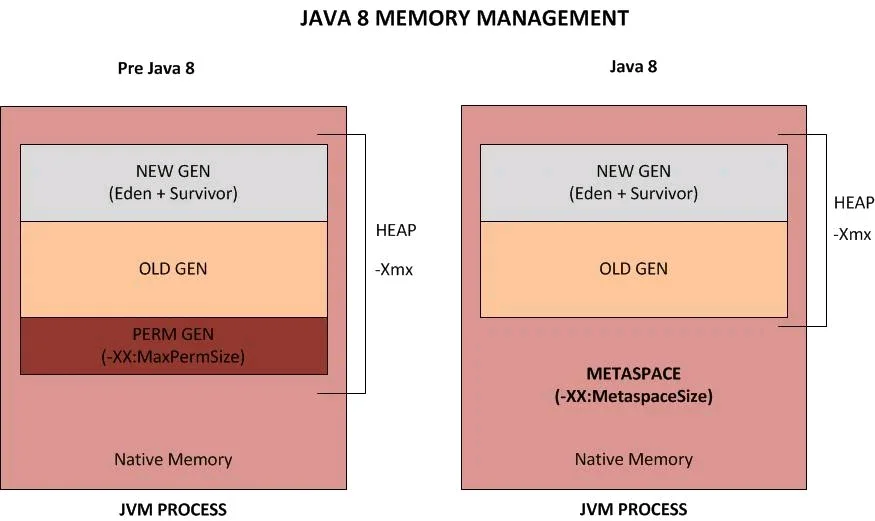

Гипотеза о поколениях:
- большинство объектов живут очень недолго;
- чем дольше объект существует, тем выше вероятность, что он будет жить дальше.

Поколения:
- Young Generation (младшее поколение) — короткоживущие объекты;
- Old Generation (старшее поколение) — долгоживущие объекты.

Типы сборок мусора:
- Minor GC — очищает Young Generation (быстро, выполняется часто);
- Full GC — очищает всю кучу (медленно, выполняется редко).

Критерии оценки сборщиков мусора:
- максимальная задержка (STW — Stop-The-World) — время, на которое программа приостанавливается;
- пропускная способность — отношение времени работы программы к времени сборки мусора;
- потребляемые ресурсы — CPU и память, используемые сборщиком.

---

## Ошибки параллелизма

### Распространённые проблемы многопоточности

1. **Race Condition (состояние гонки)** — недостаток, проявляющийся в различных результатах в зависимости от последовательности действий потоков;
2. **Deadlock** — взаимная блокировка потоков, каждый ожидает ресурс, занятый другим;
3. **Livelock** — потоки "вежливо" мешают друг другу, постоянно изменяя состояние в ответ на изменения другого потока;
4. **Starvation** — поток не получает ресурсы из-за "жадных" соседей с более высоким приоритетом.

### Чрезмерное переключение контекста

Переключение контекста — процесс сохранения состояния текущего потока и восстановления другого. Чрезмерное переключение снижает производительность:
- происходит при слишком большом количестве конкурирующих потоков;
- частой блокировке/разблокировке потоков.

Решение: правильная настройка размера пула потоков, минимизация ненужных переключений.

---

## Сложности операций над деревьями

| Tree type | | Average | Worst |
|-----------|-----------|-----------|-----------|
| **Binary search tree** | Space | Θ(n) | O(n) |
| | Insert | Θ(log n) | O(n) |
| | Search | Θ(log n) | O(n) |
| | Delete | Θ(log n) | O(n) |
| **Red black tree** | Space | O(n) | O(n) |
| | Insert | O(log n) | O(log n) |
| | Search | O(log n) | O(log n) |
| | Delete | O(log n) | O(log n) |
| **AVL tree** | Space | O(n) | O(n) |
| | Insert | O(log n) | O(log n) |
| | Search | O(log n) | O(log n) |
| | Delete | O(log n) | O(log n) |
| **B-tree** | Space | O(n) | O(n) |
| | Insert | O(log n) | O(log n) |
| | Search | O(log n) | O(log n) |
| | Delete | O(log n) | O(log n) |

- **BST** — несбалансированное дерево, в худшем случае вырождается в список;
- **Red-Black tree** — самобалансирующееся дерево, гарантирует O(log n) для всех операций;
- **AVL tree** — более строго сбалансированное, чем Red-Black, быстрее при поиске, но медленнее при вставке/удалении;
- **B-tree** — оптимизировано для дисковых структур, используется в базах данных и файловых системах.

Объект считается мертвым, если до него нельзя добраться из корней (корни — статические поля, локальные переменные в стеках и т. д.). Проблема: объекты из Young Generation могут удерживаться ссылками из Old Generation (ложное "бессмертие").

Мониторинг при помощи внутренних инструментов (встроенные в JVM):
- логирование через флаги:
 - `-verbose:gc` — базовый вывод;
 - `-Xloggc:filename` — запись в файл;
 - `-XX:+PrintGCDetails` — детализация;
 - `-XX:+PrintGCTimeStamps` — временные метки.
- использование MXBean для программного мониторинга.

Мониторинг при помощи внешних инструментов: VisualVM, Java Mission Control, JProfiler, YourKit и др. Проблема: инструменты могут влиять на работу программы (например, создавать дополнительную нагрузку).

### Модель памяти (JMM)

JMM определяет, как потоки видят изменения переменных друг друга. Процессоры используют кэши и переупорядочивают инструкции для оптимизации — в однопоточном коде это незаметно, в многопоточном может привести к гонкам.

### JSR 133

До Java 5 JMM имела недостатки: `final`-поля требовали синхронизации для видимости, `volatile` допускал неожиданное переупорядочивание. JSR 133 исправила семантику `final` и `volatile`, добавила гарантию безопасной инициализации (без утечки `this` в конструкторе).

**Happens-before** — отношение упорядочивания операций:
- в одном потоке — программный порядок;
- `synchronized` — разблокировка до повторной блокировки;
- `volatile` — запись до последующего чтения;
- `Thread.start()` — до начала выполнения потока;
- `Thread.join()` — завершение потока до возврата из `join()`.

---
## Типы GC

### 1. Serial GC

Однопоточный, последовательный. Подходит для маленьких куч (до ~100 МБ). Флаг: `-XX:+UseSerialGC`.

- **Minor GC** — копирует выжившие из Eden/Survivor в другой Survivor;
- **Full GC** — Mark-Sweep-Compact по всей куче.

Настройки: `-Xms` / `-Xmx`, `-XX:NewRatio`, `-XX:SurvivorRatio`.

### 2. Parallel GC

Многопоточный, стандартный для многоядерных систем. Флаг: `-XX:+UseParallelGC`.

- Minor и Full GC в нескольких потоках — меньше STW-пауз, чем Serial;
- автоподстройка размеров регионов.

Настройки: `-XX:ParallelGCThreads`, `-XX:MaxGCPauseMillis`, `-XX:GCTimeRatio`.

Минусы: фрагментация, не для low-latency.

### 3. CMS (Concurrent Mark Sweep)

Конкурентный, минимизирует STW. Флаг: `-XX:+UseConcMarkSweepGC`. **Устарел** (заменён G1).

- **Initial Mark** (STW) → **Concurrent Mark** → **Remark** (STW) → **Concurrent Sweep**;
- удаление без уплотнения → фрагментация;
- Concurrent Mode Failure — если не успевает, падает в полный STW.

### 4. G1

Современный сборщик, замена CMS. Флаг: `-XX:+UseG1GC`. Регионы по 1–32 МБ вместо фиксированных поколений.

- **Young GC** (STW) — очищает самые "мусорные" регионы;
- **Mixed GC** — Concurrent Marking + очистка Young + часть Old;
- **Full GC** — STW, если не хватает памяти.

Настройки: `-XX:MaxGCPauseMillis`, `-XX:G1HeapRegionSize`, `-XX:InitiatingHeapOccupancyPercent`.

Минусы: выше CPU-накладные расходы, проблемы с Humongous Objects.

### 5. Epsilon GC

Никакой сборки мусора — память не освобождается, при исчерпании `OutOfMemoryError`. JDK 11+, экспериментальный.

- Использует TLAB для быстрой аллокации без синхронизации.
- Флаги: `-XX:+UnlockExperimentalVMOptions -XX:+UseEpsilonGC`.

Применение: тесты производительности, краткоживущие задачи, приложения без мусора.

### 6. ZGC

Субмиллисекундные паузы, не зависящие от размера кучи. Production-ready с JDK 15. Флаг: `-XX:+UseZGC`.

- **Цветные указатели** (colored pointers) + виртуальная память — перемещение объектов без STW;
- барьеры в потоках приложения обновляют указатели;
- поддержка куч до 16 ТБ.

Минусы: накладные расходы на барьеры, требует больше памяти.

Применение: low-latency, очень большие кучи.

### 7. Shenandoah GC

Конкурентный low-latency сборщик. OpenJDK 12+, порты для JDK 8/11. Флаг: `-XX:+UseShenandoahGC`.

- **Brooks Pointers** — конкурентное перемещение без длинных пауз;
- режимы при нехватке ресурсов: Pacing → Degenerated GC → Full GC;
- фазы: Init Mark (STW) → Concurrent Marking → Final Mark (STW) → Concurrent Evacuation → Update Refs.

| Характеристика | Shenandoah | ZGC |
| -------------------- | ----------------------------------------------- | ------------------------------------- |
| Указатели | Brooks Pointer | Colored Pointers |
| Барьеры | Меньшие накладные расходы | Требуют больше ресурсов |
| Перемещение объектов | Конкурентное + обновление ссылок | Полностью конкурентное |
| Поддержка в JDK | С 12+ (порты для 8/11) | С 11+ (production с 15) |
| Лучше для | Средние/большие кучи, баланс latency/throughput | Очень большие кучи, ultra-low-latency |
| Generations | Нету (с jdk 21 есть) | Как в G1 |

### Максимальные (и рекомендуемые) размеры хипа для разных GC

|Сборщик мусора|Поддержка размеров хипа|Комментарии|
|---|---|---|
|Serial GC|до ~100 МБ – 1 ГБ|Очень эффективен для малых хипов, например, в приложениях для IoT, CLI и т.п.|
|Parallel GC|до нескольких десятков ГБ|Хорош для крупных хипов, где важна пропускная способность.|
|CMS (устаревший)|до ~4–8 ГБ|При больших объемах могут возникать фрагментации и паузы.|
|G1 GC|от 4 ГБ до ~32–64 ГБ (и выше)|Хорош при больших объемах, настраивается для низких пауз.|
|ZGC|от ~8 ГБ до терабайтов|Спроектирован для огромных heap'ов, с низкими задержками (<10 мс).|
|Shenandoah|от ~2–4 ГБ до сотен ГБ|Поддерживает низкие паузы, работает хорошо на больших хипах.|

Разделение поколений Young Generation (примерно):
- G1 GC: обычно 1/3 от всего heap’а;
- Parallel GC: около 1/3 от всего heap’а;
- ZGC / Shenandoah: изначально не разделяют хип на поколения, но в новых версиях поддерживают это экспериментально.

Выбор GC в зависимости от объема хипа:

| Объем heap'а | Рекомендуемый GC | Причина |
| ------------ | ------------------------ | ------------------------------------------------- |
| < 512 МБ | Serial GC | Простота и эффективность |
| 1–4 ГБ | Parallel GC / G1 GC | Баланс между паузами и производительностью |
| 4–32 ГБ | G1 GC | Хорошее управление паузами |
| 32+ ГБ | G1 GC / ZGC / Shenandoah | Для минимальных задержек и больших объемов памяти |

---
## Профилирование Java-приложений и анализ проблем

Общие принципы диагностики:
- используется метод последовательного уточнения (метод Сократа): задаются уточняющие вопросы для локализации причины сбоя;
- основные источники проблем: чрезмерная загрузка CPU, переполнение Heap, проблемы с подключениями к БД;
- основные инструменты: Grafana, Prometheus, jstack, jmap, HeapDump, ThreadDump, VisualVM, Eclipse Memory Analyzer (MAT), FastThread GUI.

### 1. Действия при высокой загрузке CPU

Проверить метрики в Grafana/Prometheus: CPU Usage, JVM Thread Live, JVM Thread States, JVM Threads Daemon. Возможные причины: утечки потоков, интенсивные RUNNABLE-потоки, неправильное использование concurrency.
 
### 2. Действия при переполнение Heap (OutOfMemoryError)

Проверить метрики: JVM Heap Memory Usage, JVM GC Live Data, JVM GC Time. Цели анализа: найти объекты, удерживаемые в памяти дольше положенного, найти крупные коллекции, утечки, чрезмерное кэширование, построить Dominator Tree, посмотреть retained size.

### 3. Действия при проблемах связанных с подключениями к базе данных

Проверить метрики в Grafana: DB Connection Pool Usage, DB Connection Wait Time, DB Query Time. Если используется HikariCP — настроить параметры:
- `maximumPoolSize` — максимальное число соединений;
- `minimumIdle` — минимальное число свободных соединений;
- `connectionTimeout` — тайм-аут при получении соединения;
- `idleTimeout` — время жизни неактивного соединения;
- `maxLifetime` — общее время жизни соединения.

---
## Ссылки

Стек — это область памяти, которая работает быстро, занимает меньше места и является потокобезопасной, поскольку у каждого потока есть собственный стек.

Объекты, создаваемые в Java (и других объектно-ориентированных языках), размещаются в куче. Когда вы используете оператор `new`, память для объекта выделяется именно в куче. Все поля объекта — как примитивные типы, так и ссылки на другие объекты — хранятся в этой же области как часть самого объекта.

Переменные, которые ссылаются на объекты, чаще всего размещаются в стеке (если это локальные переменные метода) или в других областях памяти, в зависимости от контекста. Эти переменные содержат лишь ссылки на объекты, а сами объекты находятся в куче. Например, если объект содержит поле примитивного типа, его значение сохраняется непосредственно в том участке памяти кучи, который выделен для этого объекта.

---
## Автоупаковка
 
### 1. Autoboxing

Происходит в следующих случаях:
1. при присвоении значения примитивного типа переменной соответствующего класса-обёртки;
2. при передаче примитивного типа в параметр метода, ожидающего соответствующий ему класс-обёртку.

### 2. Unboxing

Происходит в следующих случаях:
1. при присвоении экземпляра класса-обёртки переменной соответствующего примитивного типа;
2. в выражениях, где один или оба аргумента являются экземплярами классов-обёрток (например, арифметические операции `+`, `-`, `*`, `/`, `%`, операции сравнения `<`, `>`, `<=`, `>=`);

> Исключение: Операторы `==` и `!=` при сравнении двух объектов-обёрток сравнивают ссылки, а не значения (автораспаковка не происходит, если оба операнда - обёртки). Если один операнд примитив, а другой обёртка, то обёртка будет распакована.

3. при передаче объекта класса-обёртки в метод, ожидающий соответствующий примитивный тип.

 >Примечание: для `Byte`, `Short`, `Long` кэш также от -128 до 127. Для `Character` от 0 до 127. `Boolean` всегда использует `Boolean.TRUE` или `Boolean.FALSE`. `Float` и `Double` не кэшируют значения таким образом. Используйте `.equals()` для сравнения значений объектов-обёрток.
 
Автоупаковка и автораспаковка не работают для массивов целиком. Нельзя напрямую присвоить `int[]` к `Integer[]` или передать `Integer[]` в метод, ожидающий `int[]` (или `int...`) без преобразования элементов по одному.

Особенности:
* классы-обёртки неизменяемые (immutable);
* при каждой автоупаковке (за исключением значений из кэша) создается новый объект;
* в циклах или часто вызываемых методах это может привести к неразумному расходу памяти и увеличению нагрузки на сборщик мусора (Garbage Collector).

---
## Class Loaders

### Этапы получения работающего кода в JVM (согласно спецификации Java SE)

1. Загрузка (Loading):
	* поиск запрошенного класса среди уже загруженных;
	* получение байт-кода для загрузки;
	* проверка корректности байт-кода;
	* моздание экземпляра класса `java.lang.Class` (для работы с классом в runtime);
	* загрузка родительских классов и интерфейсов. (Если они не загружены, текущий класс тоже считается не загруженным).

2. Связывание (Linking / Линковка):
	* верификация (Verification): проверка корректности полученного байт-кода (структура, семантика);
	* подготовка (Preparation): выделение оперативной памяти под статические поля и инициализация их значениями по умолчанию (например, `0` для `int`, `null` для объектов). Явная инициализация происходит на этапе инициализации;
	* разрешение (Resolution): преобразование символьных ссылок (имена классов, полей, методов) в прямые ссылки на конкретные ячейки памяти.

3. Инициализация (Initialization):
	* выполнение статических блоков инициализации класса;
	* инициализация статических полей их явными значениями (если есть).

Отложенная (ленивая) загрузка классов:
- Java по умолчанию использует ленивую загрузку: классы, на которые ссылаются поля загружаемого класса, не загружаются до явного обращения к ним;
- разрешение символьных ссылок не обязательно сразу и по умолчанию не происходит;
- JVM может использовать и энергичную (eager) загрузку, где все символьные ссылки разрешаются сразу. Последнее требование выше (про ошибки разрешения) актуально для этого случая;
- разрешение символьных ссылок не привязано жестко к какому-либо этапу.

### Иерархия загрузчиков

| Загрузчик | Что загружает | Родитель |
| --------- | ------------------------------ | --------- |
| Bootstrap | Стандартные классы JDK (`rt.jar`) | `null` |
| Platform (Extension) | Модули/расширения платформы | Bootstrap |
| System (Application) | Классы приложения (`CLASSPATH`, `-cp`) | Platform |

`java.lang.ClassLoader` — базовый класс для пользовательских загрузчиков.

### Три принципа загрузки

1. **Делегирование** — сначала запрос идёт родителю, сам загружаем только если родитель не смог.
2. **Видимость** — загрузчик видит только свои классы и классы предков.
3. **Уникальность** — класс + загрузчик определяют уникальность; один класс не загружается дважды в одной иерархии.

Ход загрузки: 

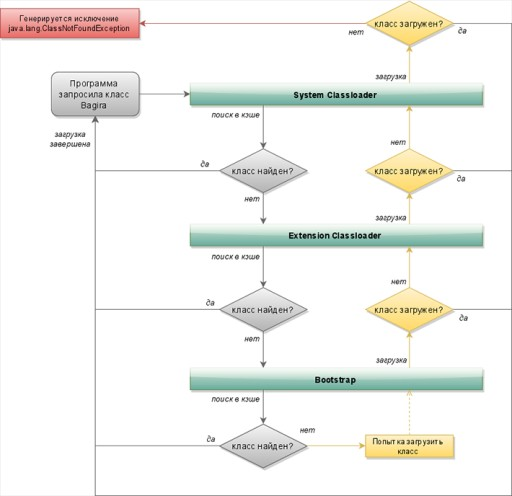

Запрос идет "вверх" по иерархии (делегирование), а фактический поиск и загрузка (если класс еще не был загружен) идет "вниз" от того загрузчика, который первым сможет его найти в своих источниках (начиная с `Bootstrap`).

Исключения: 
- `ClassNotFoundException`: возникает при динамической загрузке класса (`Class.forName()`, `ClassLoader.loadClass()`), когда загрузчики не могут найти класс ни в кэше, ни по путям поиска.
- `NoClassDefFoundError`: возникает, когда класс был доступен во время компиляции, но JVM не может найти его определение во время выполнения (например, отсутствует JAR-файл в classpath, или класс не смог инициализироваться из-за ошибки в статическом блоке).

---
## Serializable и Externalizable

| | `Serializable` | `Externalizable` |
| ------------------ | ------------------------------------ | -------------------------------------------------- |
| Контроль | JVM управляет процессом | Ручная реализация `writeExternal()` / `readExternal()` |
| Производительность | Ниже | Выше |
| Конструктор | Не требуется | Публичный без параметров — обязателен |
| `transient` | Исключает поля | Игнорируется |
| Гибкость | Можно сохранить только часть объекта | Полный контроль |

---
## Generics

Проблемы до дженериков:
- без дженериков: код требовал ручных проверок и приведения типов;
- риск: `ClassCastException` во время выполнения, если в коллекцию попал объект не того типа.

С дженериками (`List<Account>`) тип коллекции задается при объявлении, добавяляя типобезопасность на этапе компиляции. Компилятор не позволит добавить в `List<Account>` объект другого типа и сам выполняет неявное приведение типов. 

Принцип подстановки Лисков: объект подтипа (наследника) можно использовать везде, где ожидается объект супертипа (родителя), без нарушения работы программы. Пример: `Number n = Integer.valueOf(42); (Integer — подтип Number)`.

Ковариантность — иерархия наследования сохраняется (String[] является подтипом Object[]).

>Массивы — ковариантны. Это рискованно, так как ошибка типа (ArrayStoreException) проявляется только во время выполнения.

Контравариантность — иерархия наследования обращается (`Comparator<Object>` является подтипом `Comparator<String>`).

Инвариантность — Иерархия не наследуется (`List<String>` не является подтипом `List<Object>`).

>Дженерики — инвариантны (по умолчанию). Это безопасно, так как ошибка типа обнаруживается на этапе компиляции.

Wildcards делают дженерики более гибкими, добавляя им ковариантность и контравариантность:
- `List<? extends T>` (Upper Bounded / Ковариантность):
 - означает "список T или любого его наследника";
 - можно только читать (get);
 - запись запрещена (кроме null), так как компилятор не знает точного типа.
- `List<? super T>` (Lower Bounded / Контравариантность):
	- означает "список T или любого его родителя";
	- можно только записывать (add) объекты типа T; 
	- чтение вернет только Object.

Принцип PECS (Producer Extends, Consumer Super):
- если коллекция поставляет данные (вы из нее только читаете), используйте extends;
- если коллекция потребляет данные (вы в нее только пишете), используйте super.

`<?>` (Unbounded Wildcard):
- эквивалентна `<? extends Object>`;
- безопасна, но сильно ограничена (можно только читать как Object).

Raw-типы (типы без указания дженерика): 
- наследие старых версий Java; 
- их следует избегать, так как они отключают всю проверку типов и могут привести к Heap Pollution (загрязнению кучи).

>Unchecked Warning: Предупреждение компилятора о том, что операция не является типобезопасной (обычно при работе с Raw-типами).

Type Erasure (Стирание типов):
- компилятор удаляет всю информацию о дженериках (`<T>`, `<String>`) во время компиляции, заменяя их на их границы (или на Object) и добавляя необходимые приведения типов;
- обеспечивает обратную совместимость с кодом, написанным до появления дженериков;
- информация о дженериках (`List<String>`) недоступна во время выполнения.

Type Erasure (стирание типов):
- компилятор удаляет информацию о дженериках, заменяя на `Object` или границы;
- обеспечивает обратную совместимость;
- `List<String>` недоступен в runtime — нельзя `instanceof List<String>`, `new T()`.

Bridge-методы — компилятор генерирует синтетические методы для сохранения полиморфизма после стирания типов.

Reifiable Types — типы, информация о которых доступна в runtime: примитивы, непараметризованные типы (`String`), raw-типы (`List`), `List<?>`.

Non-reifiable: `List<String>`, `T`, `List<? extends Number>`.

Heap Pollution — попадание объекта "не тот тип" в параметризованную коллекцию через raw-тип → `ClassCastException`.

---
## Аннотации

Аннотации — это особые синтаксические метаданные, которые используются компилятором для различных целей.

`RetentionPolicy`:
- `SOURCE` — только в исходном коде;
- `CLASS` — в `.class`, но недоступна в runtime;
- `RUNTIME` — доступна через рефлексию.

`ElementType`: `TYPE`, `FIELD`, `METHOD`, `PARAMETER`, `CONSTRUCTOR`, `LOCAL_VARIABLE`, `ANNOTATION_TYPE`, `PACKAGE`.

---
## String

String Pool — область Heap (с Java 7; ранее PermGen) для хранения строковых литералов.

- `String s = "Hello"` — JVM ищет/добавляет в пул, возвращает существующую ссылку;
- `new String("Hello")` — создаёт объект в Heap вне пула.

```java
String s3 = new String("Hello");
```

Чтобы поместить его в пул, используется метод `intern()`:

```java
String s4 = new String("Hello").intern();
```

---
## Клонирование

Клонирование — это процесс создания копии объекта с сохранением его состояния.

### Виды клонирования

1. Поверхностное (Shallow Copy):
	- копируются только значения полей (включая ссылки);
	- объекты, на которые ссылаются поля, не клонируются — копируются только ссылки.

2. Глубокое (Deep Copy): копируются и сам объект, и все вложенные объекты, т.е. создается полностью независимая копия.

Для клонирования класс должен:
- реализовать интерфейс `Cloneable`;
- переопределить метод `clone()` из класса `Object`.

Пример: 

```java
public class Person implements Cloneable {
  int id;
  String name;

  public Object clone() throws CloneNotSupportedException {
    return super.clone();
  }
}
```

Метод `clone()` по умолчанию реализует поверхностное копирование. Для глубокого — нужно вручную клонировать вложенные объекты.

Особенности:
- без реализации `Cloneable` вызов `clone()` бросит `CloneNotSupportedException`;
- клонирование нарушает инкапсуляцию, т.к. `Object.clone()` — protected.

Также можно создать копирующий конструктор или использовать сериализацию/библиотеки (например, Apache Commons Lang `SerializationUtils.clone()`).

---
## Reflection API в Java

Reflection API (Рефлексия) — механизм, позволяющий в рантайме получать информацию о классах, конструкторах, методах, полях, аннотациях и т.д., а также изменять их.

Основные классы из пакета `java.lang.reflect`:
- `Class<T>` — основной класс для получения метаданных;
- `Field` — работа с полями;
- `Method` — работа с методами;
- `Constructor` — работа с конструкторами.

Пример:

```java
Class<?> clazz = Class.forName("com.example.Person");
Object obj = clazz.getDeclaredConstructor().newInstance();
Method method = clazz.getMethod("sayHello");
method.invoke(obj);
```

При помощи рефлексии можно делать следующее:
- узнать имя класса, пакета, суперкласса;
- получить список методов, полей, конструкторов;
- вызывать методы, даже приватные;
- изменять значения полей;
- создавать экземпляры объектов;
- проверять наличие аннотаций;
 
Преимущества:
- гибкость (можно писать универсальный код, например, для сериализации, логирования, DI-фреймворков);
- используется во многих фреймворках: Spring, Hibernate, JUnit.
 
Недостатки:
- медленнее обычного вызова;
- нарушает инкапсуляцию и безопасность;
- могут возникать ошибки в рантайме (например, `NoSuchMethodException`, `IllegalAccessException`).

---
## JIT-компилятор в HotSpot JVM

AOT (Ahead-of-Time) компиляция — исходный код сразу компилируется в машинный код для конкретной архитектуры процессора. Особенности:
- плюс: высокая производительность;
- минус: код, скомпилированный для одного процессора, может не работать на другом (низкая портативность).

Интерпретация — интерпретатор выполняет исходный код "на лету". Особенности:
- плюс: высокая портативность;
- минус: низкая производительность.

Java (гибридный подход):
1. исходный код (.java) компилируется в байт-код (.class);
2. JVM интерпретирует байт-код;
3. JIT (Just-in-Time) компилятор транслирует "горячий" (часто выполняемый) байт-код в оптимизированный машинный код прямо во время выполнения программы.

### HotSpot JIT-компилятор

JVM не компилирует весь код сразу. Она отслеживает "горячие точки" (hot spots) — методы и циклы, которые выполняются чаще всего, — и компилирует только их.

Преимуществом токого подхода является экономия ресурсов (не тратится время на компиляцию редко используемого кода). Чем дольше работает приложение, тем больше статистики (профиля) собирает JVM, что позволяет ей применять всё более продвинутые оптимизации. Единицей компиляции является метод или цикл, а результатом — nmethod (native method). 

### Многоуровневая компиляция (Tiered Compilation)

В HotSpot JVM есть два компилятора: C1 (client) и C2 (server).
- C1: быстрый, но с меньшим уровнем оптимизации;
- C2: медленный, но генерирует высокооптимизированный код.

С Java 8 по умолчанию включена многоуровневая компиляция, которая использует оба компилятора в несколько этапов:
- Уровень 0: интерпретация байт-кода;
- Уровень 1-3: компиляция с помощью C1 с разным уровнем профилирования. 

>Код быстро становится скомпилированным, но не максимально быстрым.

- Уровень 4: компиляция с помощью C2. 

>Когда код становится достаточно "горячим", C2 перекомпилирует его с максимальной оптимизацией.

Типичный путь: 0 (интерпретатор) -> 3 (C1 с профилированием) -> 4 (C2). Эта система позволяет быстро "разогреть" приложение с помощью C1 и затем довести его до пиковой производительности с помощью C2.

### Code Cache

Code Cache — cпециальная область памяти, где JVM хранит сгенерированный машинный код.

Имеет ограниченный размер. Если кэш переполняется, JIT-компилятор отключается, и новый "горячий" код перестает компилироваться, оставаясь на медленном уровне интерпретации.

Размер можно увеличить флагами `-XX:InitialCodeCacheSize` и `-XX:ReservedCodeCacheSize`.

Code Cache разделен на 3 части (с Java 9):
1. JVM internal: для внутреннего кода JVM;
2. Profiled code: для кода, скомпилированного C1 (уровни 1-3);
3. Non-profiled code: для высокооптимизированного кода от C2 (уровень 4).

### Мониторинг работы компилятора

- 1. Логирование (`-XX:+PrintCompilation`):
	- выводит в консоль информацию о каждой компиляции;
	- формат: timestamp compilation_id attributes tiered_level method_name size;
	- важный атрибут: % означает OSR (On-Stack Replacement) — компиляцию "на лету" для долгого цикла, который уже выполняется. 

- 2. Утилита jstat:
	- не требует перезапуска приложения;
	- `jstat -compiler [pid]`: Сводная информация о количестве скомпилированных методов;
	- `jstat -printcompilation [pid] 1000`: Показывает последний скомпилированный метод каждую секунду. Позволяет наблюдать за процессом в реальном времени.

---
## Типы ссылок

### Стандартная ссылка

Объект НЕ БУДЕТ удален сборщиком мусора, пока на него существует хотя бы одна сильная ссылка.

Пример: `String s = "Hello"` (s — это сильная ссылка).

### SoftReference

Объект, на который есть только мягкие ссылки, будет удален только в том случае, если JVM критически не хватает памяти (перед тем, как выбросить `OutOfMemoryError`). Идеально подходит для реализации кэшей (например, кэш изображений). Пока память есть, кэш работает быстро. Если память заканчивается, JVM сама очистит кэш, чтобы избежать падения приложения.

### WeakReference

Объект, на который есть только слабые ссылки, будет удален при следующем же запуске сборщика мусора, независимо от того, есть ли свободная память. Идеально для хранения метаданных, которые должны существовать ровно столько, сколько существует основной объект. Классический пример — `WeakHashMap`, где ключи хранятся как слабые ссылки. Как только на ключ не остается сильных ссылок извне, вся запись (ключ-значение) удаляется из Map.

### PhantomReference

Объект удаляется сборщиком в любой момент, как и в случае с `WeakReference`. Получить сам объект через фантомную ссылку невозможно (метод `get()` всегда возвращает `null`). Используется только вместе с `ReferenceQueue` для выполнения каких-либо действий после того, как объект был финализирован и готовится к удалению из памяти (например, для очистки нативных ресурсов). Это более надежная альтернатива методу `finalize()`.

### ReferenceQueue (Очередь ссылок)

Очередь, в которую помещаются "умершие" ссылки (Soft, Weak, Phantom) после того, как сборщик мусора решил удалить их объекты-референты. Позволяет отслеживать, какие объекты были удалены, и выполнять связанные с этим задачи по очистке. Особенно важна для `PhantomReference`.

---
## Утечка памяти

Утечка памяти в Java — это ситуация, когда в куче накапливаются объекты, которые больше не используются приложением, но сборщик мусора не может их удалить, потому что на них все еще существуют активные ссылки. В результате память не освобождается, что со временем приводит к замедлению работы, сбоям и, в конечном итоге, к ошибке java.lang.OutOfMemoryError.

### Основные причины утечек памяти

1. **Static коллекции** — живут вечно; если постоянно добавлять — никогда не очистятся.
2. **Незакрытые ресурсы** — `InputStream`, `Socket`, `Connection`; использовать try-with-resources.
3. **Не переопределены `equals()`/`hashCode()`** — `HashSet`/`HashMap` накапливают дубликаты.
4. **Кэш без eviction** — бесконечный рост; использовать `WeakHashMap`, `Guava Cache`, `Caffeine`.
5. **Observer / слушатели** — не отписанные слушатели удерживаются издателем.
6. **Нестатические внутренние классы** — неявная ссылка на внешний класс; делать `static`, если возможно.
7. **ThreadLocal без `remove()`** — в пуле потоков значение живёт вечно; вызывать `remove()` в `finally`.
8. **Чрезмерный `intern()`** — строки в пуле никогда не удаляются.
9. **Библиотеки** — внутренние static-кэши библиотек.

### Борьба с утечками

- Профайлеры: VisualVM, JProfiler, MAT;
- `-verbose:gc`, Heap Dump;
- `WeakReference` / `SoftReference` для кэшей;
- Регулярный code review.

---
## Объект

Все классы в Java неявно наследуют класс `java.lang.Object`. Этот класс определяет базовые методы, которые есть у любого объекта.

Методы класса `Object`:

|Метод|Описание|
|---|---|
|`equals()`|Сравнение объектов|
|`hashCode()`|Хэш-код для объекта|
|`toString()`|Строковое представление объекта|
|`clone()`|Клонирование объекта|
|`finalize()`|Очистка перед сборкой мусора (deprecated)|
|`getClass()`|Получение класса объекта|
|`notify()`|Возобновить один ожидающий поток|
|`notifyAll()`|Возобновить все ожидающие потоки|
|`wait()`|Ожидание уведомления|
|`wait(timeout)`|Ожидание с тайм-аутом|
|`wait(timeout, nanos)`|Ожидание с тайм-аутом и наносекундами|

Порядок инициализации:

| Этап | Пояснение |
| ------------------------- | ------------------------------- |
| Статические поля Parent | Инициализируются при загрузке |
| Статический блок Parent | Выполняется при загрузке |
| Статические поля Child | Инициализируются после Parent |
| Статический блок Child | Выполняется после Parent |
| Нестатические поля Parent | Инициализируются при создании |
| Нестатический блок Parent | Выполняется перед конструктором |
| Конструктор Parent | Вызывается при создании |
| Нестатические поля Child | Инициализируются после Parent |
| Нестатический блок Child | Выполняется перед конструктором |
| Конструктор Child | Выполняется последним |

---
## Прокси

Прокси-классы — это мощный инструмент для динамического изменения поведения объектов. Они позволяют "перехватывать" вызовы методов и добавлять свою логику (например, для логирования, транзакций, кэширования).

### Способы создания прокси

1. Работает через рефлексию и интерфейс `InvocationHandler`. Создает анонимный класс во время выполнения. Может создавать прокси только для классов, реализующих интерфейсы. Прокси нельзя привести к конкретному классу (User), а только к его интерфейсу (IUser).

Пример:

```java
// Default
User user = new User("Вася");

// Логика перехвата вызовов
InvocationHandler handler = (proxy, method, args) -> {
  if (method.getName().equals("getName")) {
    return ((String) method.invoke(user, args)).toUpperCase();
  }
  return method.invoke(user, args);
};

// Создание прокси
IUser userProxy = (IUser) Proxy.newProxyInstance(
  user.getClass().getClassLoader(),
  user.getClass().getInterfaces(),
  handler
);

assertEquals("ВАСЯ", userProxy.getName());
```

2. Работает через модификацию байт-кода (использует библиотеку ASM). Создает подкласс (наследника) для проксируемого объекта. Может создавать прокси для конкретных классов, не требуя интерфейсов. Не может проксировать final методы и классы, так как основан на наследовании.

Пример:

```java
// CGLIB
User user = new User("Вася");

MethodInterceptor handler = (obj, method, args, proxy) -> {
  if (method.getName().equals("getName")) {
    return ((String) proxy.invoke(user, args)).toUpperCase();
  }
  return proxy.invoke(user, args);
};

// Создание прокси с помощью "улучшателя" (Enhancer)
User userProxy = (User) Enhancer.create(User.class, handler);

assertEquals("ВАСЯ", userProxy.getName());
```

3. **Javassist** — работа с байт-кодом через фабрику классов.
4. **ByteBuddy** — современная библиотека с декларативным API для манипуляции байт-кодом.

Сравнение JDK Dynamic Proxy и CGLIB

| Характеристика | JDK Dynamic Proxy | CGLIB |
| ---------------------- | ----------------------------------------------------------------------------------------------------------------------------------- | -------------------------------------------------------------------------------------------------------------------------------------------- |
| Механизм | Рефлексия, создание анонимного класса, реализующего интерфейс. | Манипуляция байт-кодом (ASM), создание подкласса (наследника). |
| Основное требование | Объект должен реализовывать интерфейс. | Интерфейс не обязателен. Может проксировать классы напрямую. |
| Ограничение | Не может проксировать классы без интерфейсов. | Не может проксировать final классы и методы. |
| Производительность | Исторически CGLIB был быстрее. Начиная с JDK 6-8, производительность JDK Proxy была значительно улучшена и часто превосходит CGLIB. | Производительность выще если больше запросов. |
| Использование в Spring | По умолчанию: если у бина есть интерфейс, используется JDK Proxy. | Если у бина нет интерфейса, используется CGLIB. Можно принудительно включить CGLIB через <aop:aspectj-autoproxy proxy-target-class="true"/>. |

---
## Java 8

### 1. Методы по умолчанию в интерфейсах (Default Methods)

Появилась возможность добавлять в интерфейсы методы с реализацией, используя ключевое слово default. Теперь можно расширять интерфейсы, не ломая обратную совместимость. Классы, реализующие такой интерфейс, не обязаны переопределять default-метод.

### 2. Лямбда-выражения (Lambda Expressions)

Короткий синтаксис для написания анонимных функций. Позволяет заменять громоздкие анонимные классы, делая код более читаемым и компактным.

Лямбда-выражения представляют собой альтернативу анонимным классам, но между ними есть ключевые различия.

Общие черты:
- можно использовать только `final` или effectively final локальные переменные;
- доступны поля класса (в том числе статические);
- не могут выбрасывать исключения, не объявленные в `throws` функционального интерфейса.

Различия:
- в анонимных классах `this` ссылается на сам класс, а в лямбда-выражениях — на внешний класс;
- анонимные классы компилируются во внутренние классы, тогда как лямбда-выражения преобразуются в `private static`-методы с использованием `invokedynamic`, что делает их более эффективными (не требуется загрузка дополнительного класса).

Лямбда-выражения требуют `final` или effectively final переменные из внешнего контекста — это обеспечивает стабильность замыканий и потокобезопасность.

### 3. Функциональные интерфейсы

Интерфейс, который содержит ровно один абстрактный метод. Лямбда-выражение всегда имеет тип функционального интерфейса.

>@FunctionalInterface — необязательная, но помогает компилятору проверить, что в интерфейсе действительно только один абстрактный метод.

### 4. Ссылки на методы и конструкторы (Method References)

Еще более короткий синтаксис для лямбд, которые просто вызывают уже существующий метод.

>Используется оператор ::

Типы:
- ссылка на статический метод: Integer::valueOf;
- ссылка на метод экземпляра: someObject::someMethod;
- ссылка на конструктор: Person::new.

### 5. Области видимости лямбд

Лямбды могут использовать локальные переменные из внешней области, если они final или фактически неизменяемые (effectively final). Могут свободно читать и изменять поля класса и статические переменные. Только нельзя получить доступ к default-методам интерфейса напрямую из лямбды.

### 6. Встроенные функциональные интерфейсы

В Java 8 появилось много готовых интерфейсов:
- `Predicate<T>` — принимает T, возвращает boolean (для фильтрации);
- `Function<T, R>` — принимает T, возвращает R (для преобразования);
- `Supplier<T>` — мничего не принимает, возвращает T (для создания объектов);
- `Consumer<T>` — принимает T, ничего не возвращает (void, для выполнения действий);
- `Comparator<T>` — принимает (T, T), возвращает int (для сравнения).

### 7. Optional

Класс-контейнер, который может содержать или не содержать значение (null). Элегантный способ избежать `NullPointerException`.

Ключевые методы: `isPresent()`, `get()`, `orElse()`, `ifPresent()`.

### 8. Stream API

API для работы с последовательностями элементов в функциональном стиле. Предназначена для коллекций, массив и т.д.

#### Типы

1. Промежуточные операции (Intermediate) возвращают новый поток. Примеры: `filter()`, `map()`, `sorted()`. Данные операции ленивые. 

2. Конечные операции (Terminal) запускают обработку и возвращают результат. Примеры: `forEach()`, `collect()`, `count()`, `reduce()`, `anyMatch()`.

Вызов `parallelStream()` вместо `stream()` позволяет автоматически распараллелить выполнение операций на многоядерных процессорах, что может значительно ускорить обработку больших коллекций.

### 9. Новые методы в Map

Ассоциативные массивы получили новые удобные методы, такие как: `putIfAbsent()`, `forEach()`, `computeIfPresent()`, `getOrDefault()`, `merge()`.

### 10. Новый API для работы с датой и временем (java.time)

Неизменяемость (immutability) и потокобезопасность.

Основные классы:
- `LocalDate` — дата без времени и часового пояса (e.g., "2024-01-15");
- `LocalTime` — время без даты (e.g., "15:30:00");
- `LocalDateTime` — дата и время вместе;
- `ZoneId` — часовой пояс;
- `Instant` — момент времени на шкале UTC (машинное время);
- `DateTimeFormatter` — для форматирования и парсинга дат.

### 11. Повторяемые аннотации (Repeatable Annotations)

Возможность применять одну и ту же аннотацию к одному элементу кода несколько раз. Для требуется создать аннотацию-контейнер и пометить основную аннотацию с помощью `@Repeatable`. Для получения всех аннотаций используется новый метод рефлексии `getAnnotationsByType()`.

### 12. CompletableFuture

`CompletableFuture` — это класс в Java 8, предназначенный для асинхронного программирования. Он позволяет выполнять задачи в отдельных потоках, не блокируя основной поток, и предоставляет мощные средства для обработки результатов этих задач.

`CompletableFuture` решает основные проблемы своего предшественника, Future, а именно:
- невозможность завершить вручную;
- отсутствие неблокирующих колбэков;
- сложность в построении цепочек асинхронных задач;
- отсутствие удобных средств для объединения нескольких задач;
- отсутствие встроенной обработки исключений.

#### Создание

```java
CompletableFuture<String> future = new CompletableFuture<>();
future.complete("Результат готов!"); // ручное завершение
String result = future.get(); // блокирующее получение

CompletableFuture<Void> voidFuture = CompletableFuture.runAsync(() -> { ... });
CompletableFuture<String> resultFuture = CompletableFuture.supplyAsync(() -> { return "..."; });
// по умолчанию — ForkJoinPool.commonPool(); можно передать свой Executor
```

#### Обработка результатов

```java
.thenApply(name -> "Hello, " + name)    // Function<T, R> — преобразование
.thenAccept(details -> { ... })          // Consumer<T> — действие без возврата
.thenRun(() -> { ... })                 // Runnable — без доступа к результату
// Async-версии выполняются в другом потоке
```

#### Объединение

```java
.thenCompose(user -> getCreditRating(user)) // последовательное: T -> CompletableFuture<R>
.thenCombine(otherFuture, (a, b) -> ...)    // параллельное: объединение двух Future
CompletableFuture.allOf(f1, f2, f3)        // ждёт всех
CompletableFuture.anyOf(f1, f2, f3)        // ждёт любого
```

#### Обработка исключений

```java
.exceptionally(ex -> "default")           // fallback при ошибке
.handle((result, ex) -> { ... })           // всегда вызывается
```

---

## Виртуальные потоки (Project Loom)

**Виртуальные потоки** (Virtual Threads) — легковесные потоки, управляемые JVM, а не ОС. Доступны с Java 19 (preview) и Java 21 (стабильно).

### Отличия от платформенных потоков

| | Платформенные потоки | Виртуальные потоки |
|---|---------------------|-------------------|
| **Управление** | ОС | JVM |
| **Размер стека** | Фиксированный (~1 MB) | Динамический (как корутины) |
| **Количество** | Ограничено (~10 000) | Миллионы |
| **Блокировка** | Занимает ОС-поток | Освобождает носитель (carrier thread) |

### Использование

```java
// Создание виртуального потока
Thread.startVirtualThread(() -> {
    System.out.println("Running in virtual thread");
});

// ExecutorService для виртуальных потоков
try (var executor = Executors.newVirtualThreadPerTaskExecutor()) {
    executor.submit(() -> processRequest(request));
}

// В Spring Boot 3.2+
@Bean
public TomcatProtocolHandlerCustomizer<?> protocolHandlerVirtualThreadExecutorCustomizer() {
    return protocolHandler -> protocolHandler.setExecutor(Executors.newVirtualThreadPerTaskExecutor());
}
```

### Когда применять

- Массовый I/O-bound параллелизм (микросервисы, веб-приложения);
- Замена reactive-стека без изменения кода (blocking API становится масштабируемым);
- **Не применять** для CPU-bound задач (нет преимущества перед платформенными).

---

## BigDecimal для денежных расчётов

`float` и `double` не подходят для денег из-за проблем с точностью представления десятичных дробей в бинарном виде:

```java
System.out.println(0.1 + 0.2); // 0.30000000000000004 — ошибка!
```

**BigDecimal** — неизменяемый класс для точных десятичных расчётов:

```java
BigDecimal price = new BigDecimal("19.99");  // Используйте String-конструктор!
BigDecimal quantity = new BigDecimal("3");
BigDecimal total = price.multiply(quantity);  // 59.97 — точно

// Сравнение: compareTo вместо equals!
if (total.compareTo(BigDecimal.ZERO) > 0) { /* ... */ }

// Округление
BigDecimal rounded = total.setScale(2, RoundingMode.HALF_UP);
```

### Правила использования

| Правило | Почему |
|---------|--------|
| Конструктор `String`, не `double` | `new BigDecimal(0.1)` тоже даст неточность |
| `compareTo` вместо `equals` | `equals` учитывает масштаб: `1.0 ≠ 1.00` |
| Всегда указывать `RoundingMode` | При делении может возникнуть бесконечная дробь |
| Неизменяемость | Каждая операция возвращает новый объект |

В банковских приложениях `BigDecimal` является **стандартом де-факто** для всех денежных полей.
