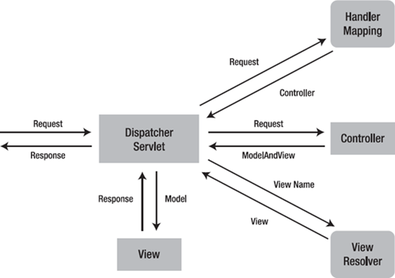

## Maven BOM

Maven BOM — это особый тип POM-файла, предназначенный для управления группой зависимостей и их версиями. Он используется для обеспечения совместимости всех зависимостей внутри одной группы (например, модулей Spring или Hibernate). Применение BOM упрощает управление зависимостями и предотвращает конфликты версий.

---
## Внутреннее устройство Spring

Основные этапы поднятия ApplicationContext:

1. `BeanDefinitionReader` парсит конфигурацию и создаёт `BeanDefinition`;
2. `BeanFactoryPostProcessor` настраивает definitions до создания бинов (например, `@Value` из properties);
3. `BeanFactory` создаёт экземпляры бинов;
4. `BeanPostProcessor` настраивает созданные бины до попадания в контекст (AOP, `@Transactional` прокси).

### 1. Сбор и парсинг конфигурации (создание `BeanDefinition`)

На этом этапе Spring анализирует конфигурацию приложения и собирает информацию обо всех будущих бинах, представляя её в виде объектов `BeanDefinition`. Эти объекты являются «рецептами» создания бинов, но не самими экземплярами. Все `BeanDefinition` сохраняются в структуре `Map<String, BeanDefinition>` внутри `BeanFactory`. В зависимости от способа конфигурации используются разные механизмы: 
- для XML применяется `XmlBeanDefinitionReader`, который читает теги `<bean>`;
- для Java-конфигурации (`@Configuration`) и сканирования компонентов (`@ComponentScan`) используется `AnnotationConfigApplicationContext`, который включает `ClassPathBeanDefinitionScanner` (ищет классы с аннотациями вроде `@Component`, `@Service`, `@Repository`) и `AnnotatedBeanDefinitionReader` (обрабатывает методы с `@Bean`);
- для использования Groovy-конфигурации применяется `GroovyBeanDefinitionReader`.

### 2. Настройка `BeanDefinition` до создания бинов

После того как все `BeanDefinition` собраны, Spring предоставляет возможность их модификации до фактического создания объектов. Это реализуется через интерфейс `BeanFactoryPostProcessor`. Все бины, реализующие этот интерфейс, автоматически обнаруживаются, и их метод `postProcessBeanFactory` вызывается с доступом ко всем `BeanDefinition`. Например, `PropertySourcesPlaceholderConfigurer` заменяет плейсхолдеры вида `${property.key}` на реальные значения из `.properties`-файлов. Без этого, аннотация `@Value("${host}")` подставила бы строку `${host}`, а не конкретный IP-адрес.

### 3. Делегирование создания бинов через `FactoryBean`
Иногда логику создания бина выгодно вынести в отдельную фабрику. Для этого Spring предоставляет интерфейс `FactoryBean<T>`. Если бин реализует этот интерфейс, Spring не использует его напрямую, а вызывает метод `getObject()` для получения итогового экземпляра. Классический пример — `ColorFactory`, который реализует `FactoryBean<Color>` и возвращает случайный цвет при каждом вызове. Хотя с появлением Java-конфигурации этот механизм используется реже, он по-прежнему полезен, когда нужна нестандартная логика инстанцирования.

### 4. Инстанцирование бинов (создание экземпляров)
На этом этапе `BeanFactory` создает реальные объекты на основе подготовленных `BeanDefinition`. Для обычных бинов используется подходящий способ создания (конструктор, фабричный метод и т.п.), а для `FactoryBean` вызывается метод `getObject()`. Таким образом формируются готовые к использованию экземпляры, которые затем переходят на следующий этап — постобработку.

### 5. Постобработка созданных бинов (`BeanPostProcessor`)

После создания экземпляров, но до их фактического использования, Spring применяет механизм постобработки через интерфейс `BeanPostProcessor`. Все соответствующие бины автоматически регистрируются, и каждый созданный объект проходит через цепочку вызовов двух методов: `postProcessBeforeInitialization()` — вызывается после создания экземпляра, но до выполнения инициализирующих методов (таких как `@PostConstruct` или `init-method`), и `postProcessAfterInitialization()` — вызывается после всех инициализаций. Именно на этом этапе обычно создаются прокси-объекты, например, для реализации AOP, транзакций или безопасности. Яркий пример — кастомный `InjectRandomIntBeanPostProcessor`, который сканирует поля бина на наличие аннотации `@InjectRandomInt` и внедряет в них случайные значения с помощью рефлексии. Важно учитывать, что постпроцессоры применяются ко всем бинам, включая `prototype`, что может оказывать влияние на производительность при большом числе объектов.

---
## Потокобезопасность бинов

[ Singleton/Session bean ] ---> [ Prototype bean ] ☹️

[ Request bean ] ---> [ Prototype bean ] 🙂

Внедрять prototype бин в singleton (или session) — плохая идея. Singleton создается один раз на все приложение, и в этот момент он получает свой экземпляр prototype бина, который тоже будет единственным. В итоге все запросы и потоки будут делить между собой этот один и тот же prototype экземпляр, что может привести к проблемам с потокобезопасностью.

А вот внедрение prototype в request-бин — это правильный и безопасный подход. Для каждого нового веб-запроса создается новый экземпляр request-бина, а значит, для него создается и свой, абсолютно новый экземпляр prototype-бина. Поскольку каждый запрос обычно обрабатывается в отдельном потоке, такая связка гарантирует, что prototype-бин будет потокобезопасным.

---
## Dispatcher Servlet

Dispatcher Servlet — это центральный компонент в Spring MVC (Model-View-Controller) архитектуре, отвечающий за координацию обработки HTTP-запросов. Он выступает в роли фронт-контроллера (Front Controller), который принимает все входящие запросы и направляет их к соответствующим компонентам системы.

Принцип работы:



---
## Сервлет

Сервлет — это Java-класс, предназначенный для обработки HTTP-запросов и формирования HTTP-ответов на стороне сервера. Он используется для создания веб-приложений на платформе Java.

Жизненный цикл любого сервлета включает четыре основных этапа:
- инициализация, которая выполняется при вызове метода `init()`;
- обработка запросов клиента происходящая при выполнении метода `service()`;
- завершение работы сервлета, инициируемое методом `destroy()`;
- окончательное удаление сервлета, осуществляемое сборщиком мусора Java (Garbage Collector).

---
## Spring Security JWT

### Аутентификация

Процесс аутентификации с помощью JWT включает отправку клиентом своих учетных данных (логин и пароль) на сервер, который в ответ выдаёт JWT-токен.

Процесс аутентификации:
1. клиент отправляет логин и пароль на API-эндпоинт, например, `/login`;
2. сервер с помощью Spring Security проверяет правильность учетных данных;
3. при успешной аутентификации сервер создаёт JWT, содержащий сведения о пользователе (например, имя пользователя и роли), и отправляет токен клиенту;
4. клиент сохраняет токен (обычно в `localStorage` или `sessionStorage`) и использует его для дальнейших запросов.

### Авторизация

При каждом новом запросе клиент передаёт JWT-токен, а сервер проверяет его для предоставления доступа к защищённым ресурсам.

Процесс авторизации:
1. клиент включает JWT в заголовок `Authorization` запроса, обычно в формате `Bearer <token>`;
2. Spring Security перехватывает запрос и проверяет наличие и валидность токена;
3. если токен корректен:
    - извлекается информация о пользователе и ролях из токена;
    - создаётся объект `Authentication` с данными пользователя;
    - запрос выполняется с учётом прав, заданных ролями пользователя.
4. если токен недействителен или истёк, сервер возвращает ошибку 401 (Unauthorized).

---
## AOP vs AspectJ

Аспектно-ориентированное программирование (AOP) — это парадигма, которая позволяет выделять так называемую сквозную функциональность (cross-cutting concerns) из основной бизнес-логики. Примеры такой функциональности — логирование, управление транзакциями, безопасность, кэширование.

Spring AOP и AspectJ — это две популярные реализации концепции AOP в мире Java. Они решают одну и ту же задачу, но делают это по-разному.

### Spring AOP

Облегченная реализация AOP, которая поставляется в комплекте с фреймворком Spring. Она идеально подходит для большинства повседневных задач. Основана на прокси-объектах, которые создаются во время выполнения приложения (at runtime).

JDK Dynamic Proxy используется, если ваш бин реализует хотя бы один интерфейс. Spring создает прокси-класс, который реализует тот же интерфейс и перехватывает вызовы методов.    

CGLIB используется, если бин не реализует интерфейсы. Spring создает подкласс вашего класса и переопределяет его методы для перехвата вызовов.

Spring AOP может применять "советы" (advice) только к вызовам публичных методов Spring-бинов. Он не может перехватывать:
- вызовы конструкторов;        
- доступ к полям;
- вызовы приватных или final методов;
- вызовы методов внутри того же объекта (this.someMethod()), так как они не проходят через прокси.

Преимущества:
- не требует дополнительной конфигурации, компиляторов или агентов, все работает "из коробки" в среде Spring;
- идеально подходит для @Transactional, @PreAuthorize (безопасность), базового логирования и метрик (достаточно для 80% задач).     

### AspectJ

Это полноценная, мощная и независимая реализация AOP. Spring может интегрироваться с AspectJ для использования его расширенных возможностей. Основан на вплетении байт-кода (weaving). Это означает, что AspectJ модифицирует скомпилированные .class файлы, напрямую встраивая в них код аспекта. 

Это может происходить на разных этапах:
-  во время компиляции с помощью специального компилятора ajc (compile-time weaving);
- модификация уже скомпилированных .class файлов (binary weaving);
- вплетение кода в момент загрузки классов в JVM с помощью специального Java-агента (load-time weaving).
        
AspectJ может перехватывать практически всё:
- вызовы методов (публичных, приватных, статических);
- вызовы конструкторов;
- чтение и запись полей;
- обработку исключений;
- инициализацию классов.

Преимущества:
- полный контроль над кодом, нет ограничений Spring AOP;        
- после вплетения кода нет дополнительного оверхеда от прокси-объектов во время выполнения;
- может применяться к любым Java-объектам, а не только к Spring-бинам.

### Сводная таблица сравнения (кратко)

| Характеристика      | Spring AOP                                     | AspectJ                                                         |
| ------------------- | ---------------------------------------------- | --------------------------------------------------------------- |
| Механизм            | Прокси-объекты (Runtime)                       | Вплетение байт-кода (Compile-time, Load-time)                   |
| Точки соединения    | Только вызовы публичных методов Spring-бинов   | Любые: вызовы методов, конструкторы, доступ к полям и т.д.      |
| Сложность настройки | Просто, ничего дополнительного не нужно        | Сложнее, требует компилятор ajc или Java-агент для LTW          |
| Производительность  | Небольшой оверхед на вызов прокси              | Максимальная, т.к. код аспекта становится частью основного кода |
| Область применения  | Только на объектах, управляемых Spring (бинах) | На любых Java-объектах, даже вне Spring-контекста               |

Использовать AspectJ (вместе со Spring) можно, когда вам нужны расширенные возможности, которые не предоставляет Spring AOP. Например:
1. нужно применить аспект к объектам, которые не являются Spring-бинами;
2. нужно перехватить вызов конструктора или доступ к полю;
3. нужно применить аспект к final классу/методу;
4. вы обнаружили, что оверхед от прокси является узким местом в производительности вашего приложения.

---

## Основная терминология AOP

| Термин | Описание |
|--------|----------|
| **Aspect (Аспект)** | Модуль или класс, реализующий сквозную функциональность. Изменяет поведение остального кода, применяя совет в точках соединения, определённых срезом. |
| **Advice (Совет)** | Фрагмент кода, который должен выполняться в отдельной точке соединения. Может быть выполнен до, после или вместо точки соединения. |
| **Joinpoint (Точка соединения)** | Чётко определённая точка в выполняемой программе, где следует применить совет. Примеры: вызов метода, инициализация класса, создание экземпляра объекта. |
| **Pointcut (Срез)** | Набор точек соединения. Определяет, подходит ли данная точка соединения к данному совету. |
| **Weaving (Связывание)** | Процесс вставки аспектов в определённую точку кода приложения. Может происходить на этапе компиляции, загрузки или выполнения. |
| **Target (Цель)** | Объект, поток выполнения которого изменяется процессом AOP. |
| **Introduction (Внедрение)** | Процесс изменения структуры объекта за счёт введения дополнительных методов или полей. |

---

## IoC и DI

**IoC (Inversion of Control)** — принцип проектирования, который переносит ответственность за создание и управление объектами из вызывающего кода в среду исполнения. При использовании IoC контейнер управляет жизненным циклом объектов и определяет, какие классы должны быть созданы и когда. Таким образом, IoC отделяет создание объектов от их использования.

**DI (Dependency Injection)** — конкретная реализация принципа IoC, которая использует механизмы (конструкторы или методы) для внедрения зависимостей в объекты. Зависимости передаются в виде параметров в конструктор или метод объекта, вместо того чтобы объект сам создавал эти зависимости. DI позволяет избавиться от жёстких зависимостей между классами и сделать код более гибким и модульным.

### Реализации IoC

Помимо DI, существуют и другие реализации принципа IoC:
- **Factory** — фабричный метод/абстрактная фабрика для создания объектов;
- **Service Locator** — объект знает, где и как получить зависимости (противоположность DI);
- **Contextualized lookup** — поиск зависимостей через контекст.

### DI в Spring

В Spring DI реализуется через:
- **Constructor injection** — предпочтительный способ. Гарантирует неизменность, обеспечивает тестируемость, явно указывает обязательные зависимости;
- **Setter injection** — для опциональных зависимостей;
- **Field injection** — через `@Autowired` (не рекомендуется для нового кода).

Лучший способ в современном Spring — использовать `@RequiredArgsConstructor` из Lombok вместе с `final`-полями:

```java
@Service
@RequiredArgsConstructor
public class UserService {
    private final UserRepository userRepository;
    private final EmailService emailService;
}
```

Преимущества конструкторной инъекции:
1. **Гарантирует неизменность** — зависимости передаются при создании объекта и не могут быть изменены;
2. **Обеспечивает тестируемость** — легко использовать mock-объекты без рефлексии;
3. **Явно указывает обязательные зависимости** — нет риска `NullPointerException`;
4. **Позволяет использовать final** — поля могут быть неизменяемыми.

---

## Жизненный цикл бина

```mermaid
flowchart LR
    subgraph Instantiation [1. INSTANTIATE BEAN]
        I(Instantiate Bean):::step1
    end

    subgraph Populate [2. POPULATE PROPERTIES]
        P1(Populate Properties):::step2
        P2(Aware Interfaces):::step2
    end

    subgraph Initialization [3. INITIALIZATION]
        direction TB
        Before(BeanPostProcessor<br/>beforeInitialization):::step3
        Init1("@PostConstruct"):::step3
        Init2(InitializingBean<br/>afterPropertiesSet):::step3
        Init3(custom init):::step3
        After(BeanPostProcessor<br/>afterInitialization):::step3
    end

    subgraph Readiness [4. BEAN IS READY TO USE]
        Ready(Ready):::step4
    end

    subgraph Destruction [5. DESTRUCTION]
        D1("@PreDestroy"):::step5
        D2(DisposableBean<br/>destroy):::step5
        D3(custom destroy):::step5
    end

    I --> P1
    P1 --> P2
    P2 --> Before
    Before --> Init1
    Init1 --> Init2
    Init2 --> Init3
    Init3 --> After
    After --> Ready
    Ready --> D1
    D1 --> D2
    D2 --> D3

    classDef step1 fill:#e1f5fe,stroke:#01579b,stroke-width:2px;
    classDef step2 fill:#e8f5e9,stroke:#2e7d32,stroke-width:2px;
    classDef step3 fill:#fff9c4,stroke:#f57f17,stroke-width:2px;
    classDef step4 fill:#f3e5f5,stroke:#7b1fa2,stroke-width:2px;
    classDef step5 fill:#ffebee,stroke:#c62828,stroke-width:2px;

    class I step1;
    class P1,P2 step2;
    class Before,Init1,Init2,Init3,After step3;
    class Ready step4;
    class D1,D2,D3 step5;
```



1. **Инстанцирование** — создание экземпляра бина через конструктор, фабричный метод или `FactoryBean.getObject()`;
2. **Наделение свойствами** — Spring устанавливает свойства и зависимости (DI);
3. **Постобработка бина** — применяются `BeanPostProcessor` (`postProcessBeforeInitialization`);
4. **Инициализация** — вызывается init-метод бина (если определён), `@PostConstruct`;
5. **Использование** — бин доступен для использования в приложении;
6. **Уничтожение** — при закрытии контекста вызывается destroy-метод (`@PreDestroy`), освобождаются ресурсы.

### Коллбэки инициализации и уничтожения

Помимо `BeanPostProcessor`, можно использовать стандартные коллбэки:

| Коллбэк | Когда вызывается |
|---------|---------------|
| `@PostConstruct` | После создания бина и DI, но до использования |
| `InitializingBean.afterPropertiesSet()` | Аналог `@PostConstruct` |
| `@PreDestroy` | Перед уничтожением бина |
| `DisposableBean.destroy()` | Аналог `@PreDestroy` |

Порядок вызова инициализации:
1. `BeanPostProcessor.postProcessBeforeInitialization()`
2. `@PostConstruct`
3. `InitializingBean.afterPropertiesSet()`
4. `BeanPostProcessor.postProcessAfterInitialization()`

---

## Scopes бинов

| Scope | Описание |
|-------|----------|
| **singleton** | (Default) Один экземпляр бина на каждый Spring IoC контейнер. |
| **prototype** | Новый экземпляр при каждом запросе бина. |
| **request** | Один экземпляр на один HTTP-запрос. Только для web-aware контекста. |
| **session** | Один экземпляр на одну HTTP-сессию. Только для web-aware контекста. |
| **application** | Один экземпляр на один `ServletContext`. Только для web-aware контекста. |
| **websocket** | Один экземпляр на один WebSocket. Только для web-aware контекста. |

---

## @Controller vs @RestController

`@RestController = @Controller + @ResponseBody`

- `@Controller` — помечает класс как Spring MVC контроллер. Возвращает имя View для рендеринга.
- `@RestController` — все методы по умолчанию возвращают данные (JSON/XML) в тело ответа через `HttpMessageConverter` (обычно Jackson).

### @ResponseBody vs ResponseEntity

- `@ResponseBody` — автоматически сериализует возвращаемое значение в тело HTTP-ответа. Статус всегда 200 (или 500 при ошибке);
- `ResponseEntity` — позволяет полностью контролировать HTTP-ответ: статус-код, заголовки, тело.

Используйте `ResponseEntity`, когда нужно вернуть специфический статус (201 Created, 204 No Content) или кастомные заголовки.

---

## Spring Boot

Spring Boot — расширение Spring, которое устраняет необходимость в рутинных настройках:

1. **Starter-зависимости** — готовые наборы зависимостей (`spring-boot-starter-web`, `spring-boot-starter-data-jpa`);
2. **Встроенный сервер** — Tomcat/Jetty/Undertow встроены, упрощает развёртывание;
3. **Автоконфигурация** — Spring Boot автоматически настраивает бины на основе classpath и properties;
4. **Actuator** — готовые endpoints для мониторинга (`/health`, `/metrics`, `/info`).

### Создание стартера

Starter — набор зависимостей и готовых автоконфигураций. Позволяет избежать ручного создания бинов.

Для создания:
1. Создать в ресурсах `META-INF/spring.factories` (или `META-INF/spring/org.springframework.boot.autoconfigure.AutoConfiguration.imports` в Spring Boot 2.7+);
2. Определить автоконфигурацию:

```properties
org.springframework.boot.autoconfigure.EnableAutoConfiguration=\
com.example.MyAutoConfiguration
```

3. Создать класс конфигурации с условными бинами (`@ConditionalOnClass`, `@ConditionalOnMissingBean`).

---

## i18n (Internationalization)

Spring Boot предоставляет встроенную поддержку локализации через `MessageSource`.

### Базовая настройка

1. Создать файлы переводов в `src/main/resources`:
   - `messages.properties` — fallback по умолчанию
   - `messages_en.properties` — английский
   - `messages_fr.properties` — французский

2. Spring Boot автоматически конфигурирует `MessageSource` при наличии файлов `messages*.properties`.

3. Настройка в `application.properties`:

```properties
spring.messages.basename=messages
spring.messages.encoding=UTF-8
spring.messages.fallback-to-system-locale=true
```

### Использование в REST

```java
@RestController
@RequiredArgsConstructor
public class GreetingController {
    private final MessageSource messageSource;

    @GetMapping("/api/greet")
    public String greet(@RequestHeader(name = "Accept-Language", required = false) Locale locale) {
        return messageSource.getMessage("greeting.message", null, locale);
    }
}
```

По умолчанию Spring использует `AcceptHeaderLocaleResolver` — определяет локаль из HTTP-заголовка `Accept-Language`.

---

## Spring Security: полное руководство

### Аутентификация и авторизация

- **Аутентификация** — процесс проверки личности пользователя (логин/пароль, токен, сертификат);
- **Авторизация** — определение, какие действия пользователь может выполнять.

### JWT (JSON Web Token)

**Аутентификация с JWT:**
1. Клиент отправляет учётные данные на `/login`;
2. Сервер проверяет данные и создаёт JWT, содержащий claims (username, roles);
3. Клиент сохраняет JWT (localStorage/sessionStorage) и отправляет в заголовке `Authorization: Bearer <token>`.

**Авторизация с JWT:**
1. Spring Security фильтр перехватывает запрос, проверяет токен;
2. Если валиден — извлекаются роли, создаётся объект `Authentication`;
3. Запрос выполняется с правами пользователя;
4. Если токен недействителен — `401 Unauthorized`.

### Access Token и Refresh Token

| Токен | Назначение | Время жизни |
|-------|-----------|-------------|
| **Access Token** | Предоставляет доступ к защищённым ресурсам | Короткое (минуты) |
| **Refresh Token** | Используется для обновления Access Token без повторной аутентификации | Долгое (дни/недели) |

### CSRF / CORS / XSS

| Угроза | Описание | Защита |
|--------|----------|--------|
| **CSRF** | Атака, при которой злоумышленник отправляет запрос от имени авторизованного пользователя | CSRF-токен в формах, отключение для stateless API |
| **CORS** | Механизм, позволяющий веб-страницам запрашивать ресурсы с другого домена | Настройка `CorsConfigurationSource`, разрешённые origins |
| **XSS** | Внедрение вредоносного скрипта в веб-страницы | Экранирование вывода, Content Security Policy |

### Spring Security Filter Chain

Цепочка фильтров, обрабатывающих запросы перед контроллером:
- `SecurityContextPersistenceFilter` — восстановление `SecurityContext`;
- `UsernamePasswordAuthenticationFilter` — аутентификация по логину/паролю;
- `ExceptionTranslationFilter` — обработка исключений безопасности;
- `FilterSecurityInterceptor` — авторизация доступа к ресурсу.

### Аннотации авторизации

- `@PreAuthorize("hasRole('ADMIN')")` — проверка перед выполнением метода;
- `@PostAuthorize` — проверка после выполнения;
- `@Secured("ROLE_ADMIN")` — устаревшая альтернатива;
- `@RolesAllowed` — стандарт Java EE.

---

## Spring Transactions: Propagation

Propagation определяет поведение транзакции при вызове из другой транзакции.

| Propagation | Вызов из `@Transactional` | Вызов без `@Transactional` |
|-------------|---------------------------|----------------------------|
| **REQUIRED** (default) | Использует существующую транзакцию | Создаёт новую транзакцию |
| **REQUIRES_NEW** | Создаёт отдельную транзакцию, внешняя приостанавливается | Создаёт новую транзакцию |
| **SUPPORTS** | Использует существующую транзакцию | Выполняется без транзакции (auto-commit) |
| **NOT_SUPPORTED** | Выполняется вне транзакции, существующая приостанавливается | Выполняется без транзакции |
| **NEVER** | Выбрасывает исключение | Выполняется без транзакции |
| **MANDATORY** | Использует существующую транзакцию | Выбрасывает исключение |
| **NESTED** | Создаёт nested-транзакцию (savepoint) | Создаёт новую транзакцию |

### Рулбеки

По умолчанию Spring откатывает транзакцию только при unchecked исключениях (`RuntimeException`).

- `rollbackFor` — исключения, при которых транзакция БУДЕТ откатана;
- `noRollbackFor` — исключения, при которых транзакция НЕ будет откатана;
- `readOnly = true` — оптимизация: подсказывает, что транзакция только читает данные.

### Физические и логические транзакции

- **Physical transaction** — реальная JDBC-транзакция (`Connection.setAutoCommit(false)`);
- **Logical transaction** — `@Transactional`-метод в Spring. Несколько logical транзакций могут быть объединены в одну physical.

Когда `@Transactional` метод вызывает другой `@Transactional` метод:
- С `REQUIRED` — одна physical транзакция;
- С `REQUIRES_NEW` — две physical транзакции.

---

## Дополнительные возможности Spring

### RestTemplate и Feign

**RestTemplate** — синхронный HTTP-клиент Spring:

```java
RestTemplate restTemplate = new RestTemplate();
User user = restTemplate.getForObject("https://api.example.com/users/{id}", User.class, 1L);
```

Устарел в пользу `RestClient` (Spring 6.1+) или `WebClient` (реактивный).

**OpenFeign** — декларативный HTTP-клиент:

```java
@FeignClient(name = "userService", url = "https://api.example.com")
public interface UserClient {
    @GetMapping("/users/{id}")
    User getUser(@PathVariable Long id);
}
```

### JdbcTemplate

Упрощает работу с JDBC, устраняя бойлерплейт:

```java
@Repository
@RequiredArgsConstructor
public class UserJdbcDao {
    private final JdbcTemplate jdbcTemplate;

    public User findById(Long id) {
        return jdbcTemplate.queryForObject(
            "SELECT id, name FROM users WHERE id = ?",
            (rs, rowNum) -> new User(rs.getLong("id"), rs.getString("name")),
            id
        );
    }
}
```

### Обработка исключений: @ControllerAdvice

Глобальная обработка исключений:

```java
@RestControllerAdvice
public class GlobalExceptionHandler {
    @ExceptionHandler(UserNotFoundException.class)
    public ResponseEntity<ErrorResponse> handleUserNotFound(UserNotFoundException ex) {
        return ResponseEntity.status(HttpStatus.NOT_FOUND)
            .body(new ErrorResponse(ex.getMessage(), LocalDateTime.now()));
    }

    @ExceptionHandler(MethodArgumentNotValidException.class)
    public ResponseEntity<Map<String, String>> handleValidationErrors(MethodArgumentNotValidException ex) {
        Map<String, String> errors = new HashMap<>();
        ex.getBindingResult().getFieldErrors().forEach(error ->
            errors.put(error.getField(), error.getDefaultMessage()));
        return ResponseEntity.badRequest().body(errors);
    }
}
```

### Работа по расписанию: @Scheduled

```java
@Service
public class ReportService {
    @Scheduled(cron = "0 0 6 * * MON")  // Каждый понедельник в 6:00
    public void weeklyReport() { /* ... */ }

    @Scheduled(fixedRate = 60000)       // Каждую минуту
    public void healthCheck() { /* ... */ }
}
```

Требует `@EnableScheduling` в конфигурации.

### Кэширование

```java
@Service
@RequiredArgsConstructor
public class ProductService {
    private final ProductRepository repository;

    @Cacheable(value = "products", key = "#id")
    public Product findById(Long id) {
        return repository.findById(id).orElseThrow();
    }

    @CacheEvict(value = "products", key = "#product.id")
    public Product update(Product product) {
        return repository.save(product);
    }

    @CacheEvict(value = "products", allEntries = true)
    public void clearCache() { }
}
```

Требует `@EnableCaching` и настройки провайдера (Caffeine, Redis, EhCache).

### События и слушатели

```java
// Событие
public class UserRegisteredEvent extends ApplicationEvent {
    private final Long userId;
    public UserRegisteredEvent(Object source, Long userId) { super(source); this.userId = userId; }
}

// Публикация
@Service
@RequiredArgsConstructor
public class UserService {
    private final ApplicationEventPublisher publisher;

    public void register(UserDto dto) {
        // ... сохранение
        publisher.publishEvent(new UserRegisteredEvent(this, savedUser.getId()));
    }
}

// Слушатель
@Component
public class UserEventListener {
    @EventListener
    @Async  // асинхронная обработка
    public void handleUserRegistered(UserRegisteredEvent event) {
        // отправка email, логирование и т.д.
    }
}
```

### Асинхронность: @Async

```java
@Service
public class NotificationService {
    @Async("taskExecutor")  // можно указать конкретный Executor
    public CompletableFuture<Void> sendEmail(String to, String subject) {
        // длительная операция
        return CompletableFuture.completedFuture(null);
    }
}
```

Требует `@EnableAsync` и настройку `TaskExecutor`.

### Настройки Tomcat

По умолчанию Spring Boot (starter-web) использует встроенный Tomcat:
- **Без нагрузки**: создаёт 10 потоков (`server.tomcat.threads.min-spare`);
- **Под нагрузкой**: масштабируется до 200 потоков (`server.tomcat.threads.max`).

```yaml
server:
  tomcat:
    threads:
      max: 200
      min-spare: 10
```

